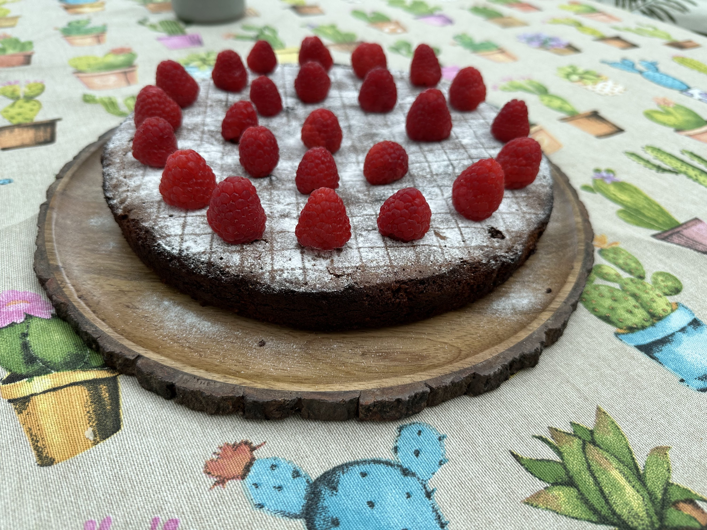
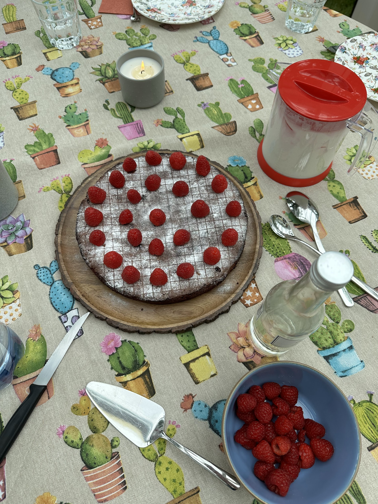
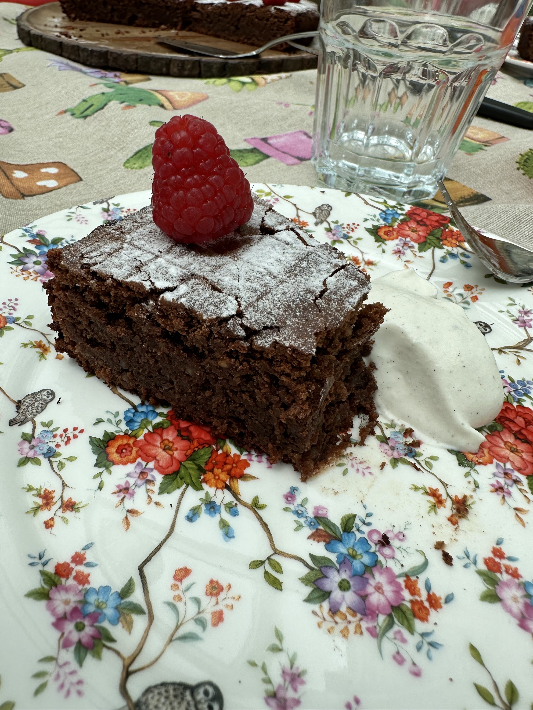

# 🍰 Chocolate Fondant Cake

## Ingredients

* 5 eggs
* 250g sugar
* 200g dark chocolate (54%)
* 100g almonds
* 200g butter
* 3 table spoon cornstarch (maisstärke)
* 1 packet vanilla sugar&#x20;
* 1 teaspoon baking soda

## Instructions

1. Split 5 eggs in separate bowls yolk vs. egg whites
2. Beat 5 egg whites stiff -> put in fridge
3. Combine egg yolks with sugar and beat foamy
4. Melt chocolate and put it with egg yolks
5. Add soft butter
6. Add all remaining solid ingredients
7. Put egg whites under (DE: unterheben)
8. Cook at 200°C for 30min. Stick test will likely fail but it's still okay.

## Results

Cake is nice and moist. Can be dressed up with raspberries and cream.

<figure><figcaption></figcaption></figure>

 

<figure><figcaption></figcaption></figure>

 

<figure><figcaption></figcaption></figure>

