# 📐 Architecture Workshop

The idea is to create a software architecture for a fictional java backend application. In order to get different NFRs for all workshop participants chatGPT is used with the following prompt:


```
Create me a list of non-functional software requirements for a webapplication backend written in java. Limit the list to 10 entries. The requirements should be in the categories "performance", "reliability", "scalability", "automation", "availability".
```


for me this resulted in the following NFRs:

**Performance**

1. **Response Time**: All API endpoints must respond within 200 milliseconds under peak load.
2. **Throughput**: System should handle 10,000 simultaneous API requests per second.

**Reliability**

3. **Fault Tolerance**: Automatic failover to secondary server in less than 30 seconds in case of primary server failure.
4. **Data Backup**: Incremental backups every 6 hours, with full backups weekly.

**Scalability**

5. **Horizontal Scalability**: Able to add additional nodes without system downtime.
6. **Database Sharding**: Support for database sharding to distribute the load.

**Automation**

7. **Deployment Automation**: Zero-downtime deployment using CI/CD pipelines.
8. **Monitoring Automation**: Automated real-time system monitoring and alerting.

**Availability**

9. **Uptime**: 99.9% service availability, not counting scheduled maintenance.
10. **Geo-Redundancy**: Availability zones in at least 3 geographic regions for data and application failover.

## Initial thoughts

* **10'000 reqs/s is a lot**
  * how many server nodes are needed to handle this demand? autoscaling?
  * how demanding is a request?
  * is data read/write or mostly read? If it is read/write is it data that needs to be available across all nodes immediately e.g. online shop inventory or is eventually consistency ok?
  * nodes should be stateless
  * where can caching be implemented?
* **200ms peak response time**
  * seems doable, within normal limits, although guaranteeing it might be difficult
* **Fault tolerance with 30s failover**
  * the data needs to be kept in sync for this to work, although given all the other requirements scalability, sharing etc. a cloud solution is likely, so many small server can be used, which would enable this a bit more easily
* **DB backup**
  * seems doable, although it might be more difficult to do the full backups if the DB is very large
* **Scaling: adding nodes without downtime, db sharding**
  * again leading in the direction of cloud services. This might be difficult to do if on premise solution is required
* **Automation/deployment**
  * seems doable, makes sense
  * monitoring is needed anyway for failover etc.

#### Assumed application details

* The application needs to persist some data. In order to decide what kind of db to use we need to know what sort of data this is. Let's assume the application has some kind of social media component, e.g. similar to how Galaxus shares purchases on a public profile page or an actual social media like X or facebook. -> eventually consistent
* Let's also assume that the application has some structured user data, for purchases, login etc. that needs to be consistent all the time.

## Solution design

This case seems targeted at using a public cloud offering such as AWS or Google. On premise this may be difficult to implement, but could be done with a Kubernetes Cluster or similar. Although the last NFR about geo redundancy would make this very expensive and only feasible for a large multinational corp.

```mermaid
graph TD
LB1("🟢 Load Balancer 1 (active)")
LB2("🔴 Load Balancer 2 (passive)")

DNS("🛜 DNS Server")
LBMonitoring("✅ LB Monitoring \n (receives heartbeat from LB1/2)")
LBMonitoring --> |elect active LB|DNS

A("User Input 🙍‍♂️ \n (Frontend)")-->|10'000req/s \n max 200ms resp. time|DNS
DNS --> LB1
DNS -.-> LB2
LB1 --> |redirects to 1 of n \n backend nodes|BeNodes("⚙️ Backend Node 1 of n")
LB2 -.-> BeNodes

Config("🔧 Configuration Server")
BeNodes --> |load configuration on startup|Config

Cache[("Cache \n (e.g. Redis or similar) \n with TTL")]
BeNodes --> |"read (lazy loading)"|Cache

DB[("Database Cluster \n(with horizontal sharding \n e.g. based on region?)")]

dataWrite{{write/update data}}
BeNodes --> dataWrite
dataWrite --> Cache
dataWrite --> DB
BeNodes -->|read in case of cache miss \n -> update cache| DB

MonitoringStats[("Monitoring:\n Time Series DB (e.g. Influx) \n user count, uptime, etc.")]
MonitoringDashboard("📈 Monitoring:\n Dashboard (e.g. Grafana)")
MonitoringDashboard --> MonitoringStats
BeNodes --> |push logs| MonitoringLogs
BeNodes --> |pushes metrics|MonitoringStats

MonitoringLogs("📜 Monitoring:\n Log Analysis (e.g. Kibana)")

```



### Data storage & sharding

#### Is a external load balancer needed for writing to the DB?

1. **Master-Slave Replication**: In this setup, only the master node can handle write operations. Slaves are read-only. No external load balancer is needed for writes.
2. **Multi-Master Replication**: Multiple nodes can accept write operations. Some databases have built-in logic to distribute these writes, but this can be complex and prone to conflicts.
3. <mark style="color:green;">**Sharding**</mark>: If the database supports native sharding, it may be able to route write operations to the appropriate shard without an external load balancer.

#### Relational vs. NoSQL DB

* **NoSQL**: Given the high volume of reads, requirement for real-time analytics, data model flexibility, and the eventual consistency nature of social interactions, a NoSQL database like Cassandra for the main data store and Redis for caching can be an effective combination.
* **Hybrid**: A hybrid approach using NoSQL for user interactions and relational databases for billing, reporting, or where strong ACID compliance is required can also be effective.

#### Sharding

* Sharding needs to be considered when doing the db schema design
  * **Vertical** sharding: Distributes columns across multiple databases or tables. Each shard contains a different schema but serves the same set of records.
  * **Horizontal** sharding: Distributes rows across multiple databases or tables. Each shard contains the same schema but different subsets of data.
  * see more: [https://aws.amazon.com/blogs/database/sharding-with-amazon-relational-database-service/](https://aws.amazon.com/blogs/database/sharding-with-amazon-relational-database-service/)
* Horizontal sharding is generally more common for several reasons:
  1. **Scalability**: It's easier to scale horizontally-sharded databases by just adding more servers.
  2. **Uniformity**: Horizontal sharding often requires less drastic changes to application logic and SQL queries.
  3. **Data Distribution**: Easier to distribute data evenly across shards, which is important for load balancing.
  4. **Flexibility**: Can be applied to any part of the database schema, whereas vertical sharding often involves a more rigid, less flexible structure.
  5. **Maintenance**: Generally easier to rebalance, backup, or migrate.

### Caching

* Write-Through Strategy: Every write/update writes to both the DB and the cache at the same time.
* Cached data has a TTL, when TTL is exceeded these entries are dropped to keep the cache from growing too large for seldom used data.
* When reading the cache is consulted first, if the entry is not found the data is loaded from the DB and written to the cache

### Microservices

tbd

### Todo:

* load balancer failover in 30s possible? how does dns failover work?
* missing: geo zones, redirect based on geo location
* microservices
  * what does the backend node do?
