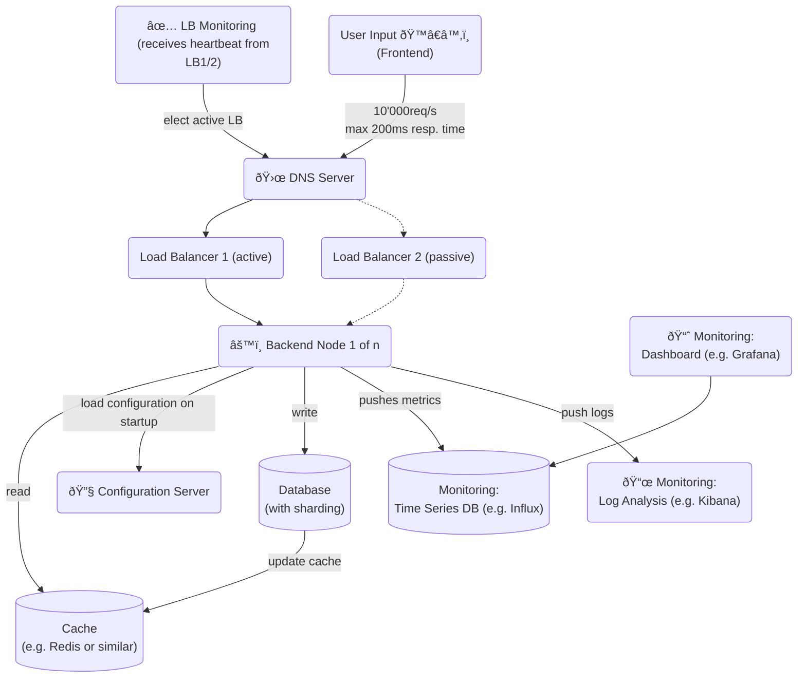

# 📠Software Architecture

## Zühlke Camp Architecture Workshop (04.09.23)

### Setup

The idea is to create a software architecture for a fictional java backend application. In order to get different NFRs for all workshop participants chatGPT is used with the following prompt:


```
Create me a list of non-functional software requirements for a webapplication backend written in java. Limit the list to 10 entries. The requirements should be in the categories "performance", "reliability", "scalability", "automation", "availability".
```


for me this resulted in the following NFRs:

**Performance**

1. **Response Time**: All API endpoints must respond within 200 milliseconds under peak load.
2. **Throughput**: System should handle 10,000 simultaneous API requests per second.

**Reliability**

3. **Fault Tolerance**: Automatic failover to secondary server in less than 30 seconds in case of primary server failure.
4. **Data Backup**: Incremental backups every 6 hours, with full backups weekly.

**Scalability**

5. **Horizontal Scalability**: Able to add additional nodes without system downtime.
6. **Database Sharding**: Support for database sharding to distribute the load.

**Automation**

7. **Deployment Automation**: Zero-downtime deployment using CI/CD pipelines.
8. **Monitoring Automation**: Automated real-time system monitoring and alerting.

**Availability**

9. **Uptime**: 99.9% service availability, not counting scheduled maintenance.
10. **Geo-Redundancy**: Availability zones in at least 3 geographic regions for data and application failover.

### Exercise

#### Initial thoughts

* **10'000 reqs/s is a lot**
  * how many server nodes are needed to handle this demand? autoscaling?
  * how demanding is a request?
  * is data read/write or mostly read? If it is read/write is it data that needs to be available across all nodes immediately e.g. online shop inventory or is eventually consistency ok?
  * nodes should be stateless
  * where can caching be implemented?
* **200ms peak response time**
  * seems doable, within normal limits, although guaranteeing it might be difficult
* **Fault tolerance with 30s failover**
  * the data needs to be kept in sync for this to work, although given all the other requirements scalability, sharing etc. a cloud solution is likely, so many small server can be used, which would enable this a bit more easily
* **DB backup**
  * seems doable, although it might be more difficult to do the full backups if the DB is very large
* **Scaling: adding nodes without downtime, db sharding**
  * again leading in the direction of cloud services. This might be difficult to do if on premise solution is required
* **Automation/deployment**
  * seems doable, makes sense
  * monitoring is needed anyway for failover etc.

#### Initial solution

This case seems targeted at using a public cloud offering such as AWS or Google. On premise this may be difficult to implement, but could be done with a Kubernetes Cluster or similar. Although the last NFR about geo redundancy would make this very expensive and only feasible for a large multinational corp.



#### Backend Node

* stateless
* gets configuration from configuration server
