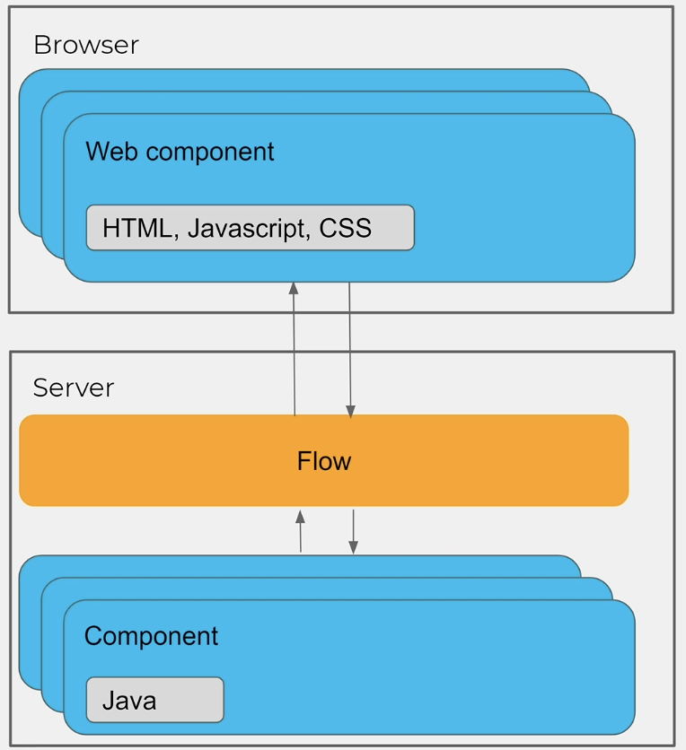

# Vaadin

### What's the USP of Vaadin?

Vaadin claims to be the only framework focused on building PWAs on the Java platform. It's vendor-backed open source and a stable foundation to build on. It also claims to have best-in-class components to make building highly usable applications easy.

### Vaadin Training

[https://vaadin.com/learn/training/v14](https://vaadin.com/learn/training/v14)

### Create a new project

1. Go to [https://vaadin.com/start](https://vaadin.com/start)
2. Select a vaadin version and download the sample setup
3. To run the sample application: `mvn jetty:run` and open http://localhost:8080 to view it
4. Debug configuration &gt; New MVN run configuration: Command line: `jetty:run`

### Architecture

### Web Components

Vaadin 14 makes use of webcomponents, some advantages are:

* clean & easily readable DOM tree when inspecting elements in browser
* real runtime CSS scoping with shadow DOM
* reusability, web components can also be used with Angular, Vue.js and many other frameworks. They're not tied to Vaadin
* Stability, built to live long due to web standards
* Get pre-built web components e.g. from [https://www.webcomponents.org/](https://www.webcomponents.org/)

#### Integrated Web Components from other developers

1. npm install --save @sample/sample-component
2. Create Java class to connect frontend component to backend `@Tag("sample-component") @JsModule("@sample/sample-component.js") public class SampleComponent extends Component{}`

### Tools

* **Testbench**: Starts up a browser and runs UI tests against application. Based on selenium.
* **Vaadin Designer:** IDE plugin for IntelliJ. Visual tool to create Vaadin applications with drag and drop.

## Notes

* [Testing the UI without a browser \(Vaadin.com\)](https://vaadin.com/blog/testing-the-ui-without-a-browser)

