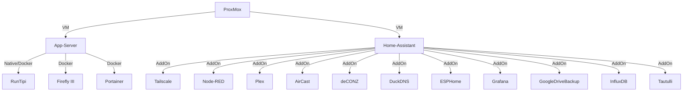

# 🧪 My Home Server

```mermaid
flowchart TD
    ProxMox -- VM --> App-Server
    ProxMox -- VM --> Home-Assistant

    App-Server -- Native/Docker --> RunTipi
    App-Server -- Docker --> Firefy-III[Firefly III]
    App-Server -- Docker --> Portainer

    Home-Assistant -- AddOn --> Tailscale
    Home-Assistant -- AddOn --> Node-RED
    Home-Assistant -- AddOn --> Plex
    Home-Assistant -- AddOn --> AirCast
    Home-Assistant -- AddOn --> deCONZ
    Home-Assistant -- AddOn --> DuckDNS
    Home-Assistant -- AddOn --> ESPHome
    Home-Assistant -- AddOn --> Grafana
    Home-Assistant -- AddOn --> GoogleDriveBackup
    Home-Assistant -- AddOn --> InfluxDB
    Home-Assistant -- AddOn --> Tautulli

```

