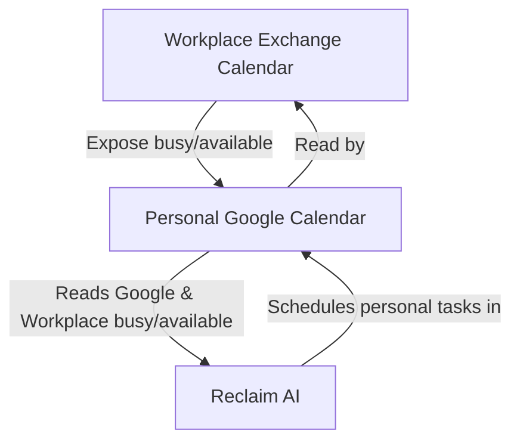

# From developer to architect

## Task management

As an architect, you handle many small tasks with varying deadlines. Managing them can be challenging, so you need an effective process to stay organized.

I currently use [Reclaim AI](https://reclaim.ai/) as a way to keep track of my tasks, their importance & deadlines.&#x20;

Whenever I fulfill a scheduled task I only need to delete it from the calendar and Reclaim AI will schedule it again in an appropriate time slot. I've also configured Reclaim AI to give me a 15min break between tasks - this makes the created schedule a bit more robust when people call/message or I need to take break.

## Learnings

* **Tradeoffs**
  * First Law of Software Architecture: «Everything in architecture is a tradeoff»
  * First Corollary: «If you think you’ve found something that isn’t a tradeoff, it just means you haven’t identified the tradeoff yet»
  * There are no right or wrong answers in architecture; rather, it’s always about tradeoffs
* **Structural design of software architecture**
  * Determine what architecture characteristics are present within the problem space.&#x20;
  * Do logical component analysis to understand the problem domain.
* **As an architect, you should think about the artifacts within the architecture in terms of components**
  * Entity Trap: Do not consider every entity as a component, e.g. auction manager, item manager, bid manager. Instead consider workflows and identify actors.
* **Architecture styles**
  * Monolithic: layered vs. modular
  * Microkernel
  * Event-driven: broker vs. mediator
  * microservices
  * service-based architecture
  * space-based architecture
* **Second Law of Software Architecture: «Why is more important than how»**
  * Every architecture decision should be accompanied with a technical and business justification
  * Document decisions in architectural decision records (ADRs)
  * [Examples](https://github.com/joelparkerhenderson/architecture-decision-record?tab=readme-ov-file)

## Vocabulary

<table><thead><tr><th width="183">Word</th><th width="210">Synonyms</th><th>Descriptions</th></tr></thead><tbody><tr><td>Architecture characteristics</td><td>Non functional requirements</td><td>As opposed to requirements that describe the systems behavior architecture characteristics describe the systems capabilities. Examples are: Reliability, Scalability, Performance, Availability</td></tr><tr><td>ADR</td><td></td><td>Architectural Decision Records (ADR) document architecture decisions.</td></tr><tr><td></td><td></td><td></td></tr><tr><td></td><td></td><td></td></tr></tbody></table>

## Resources

* [Software Developer to Architect](https://www.developertoarchitect.com/)
* [Software Architecture by Example (recommended by Alicia)](https://learning.oreilly.com/live-events/software-architecture-by-example/0636920261797/0790145064900/)
  * [Fundamentals of Software Architecture: An Engineering Approach](https://learning.oreilly.com/videos/fundamentals-of-software/9781663728357/)
