# 🇩🇰 Denmark

## Copenhagen

Copenhagen is a beautiful city with tons of things to see and do. Due to being close to the coast the weather can be a bit unpredictable. In July/early August it's best to always carry a light jacket and umbrella. It also helps to be a bit flexible with planning and just hop into a café or book store when it rains for a bit.

### Nyhavn

Beautiful harbour canal area with lots of little bars and restaurants. Ideal for taking a photo of the colourful townhouses and just wandering around a bit. This is also the spot where the river cruise boats dock for a quick bit of sightseeing.

<figure>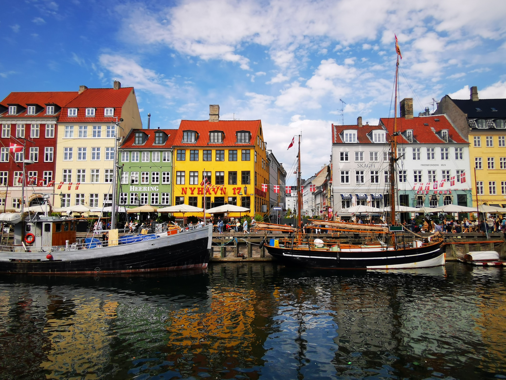<figcaption></figcaption></figure>

 

<figure>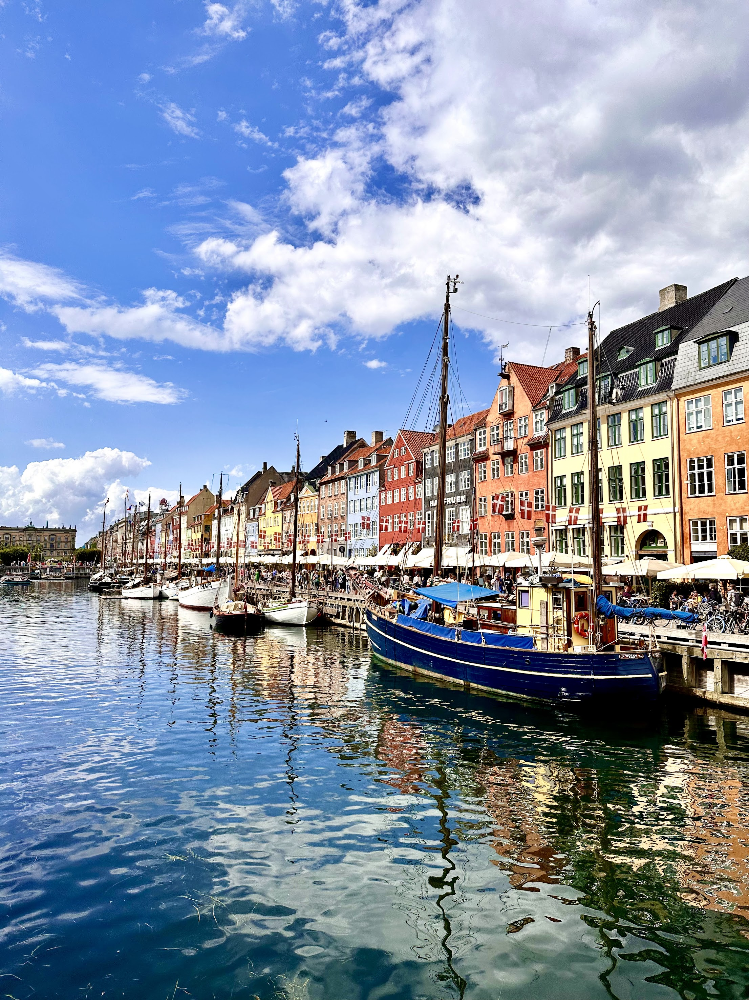<figcaption></figcaption></figure>

 

<figure>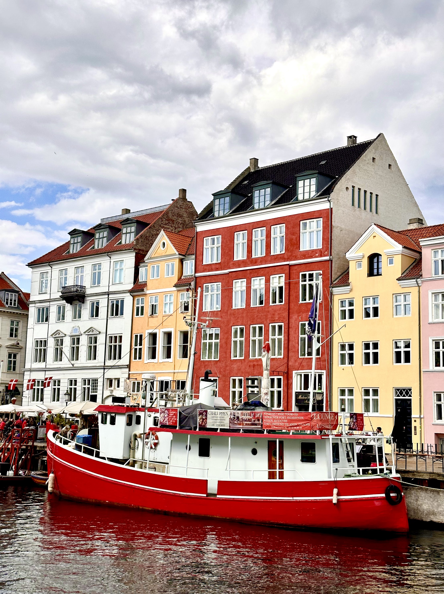<figcaption></figcaption></figure>

### Church of Our Saviour / Christiania

The church has a golden spire on top that you can climb. From there you get an amazing view over the city and climbing the spire is also a pretty cool experience in and of itself. There is an entry fee but imho it's well worth the money.

<figure><figcaption></figcaption></figure>

 

<figure><figcaption></figcaption></figure>

 

<figure><figcaption></figcaption></figure>

While waiting for our time slot to climb the spire we had a quick look at the commune Christiania. There is some cool street art there and one of the danish troll statues, but overall I found it a bit underwhelming. There was not a lot going on and there were mainly tourists wandering around the place.

<figure>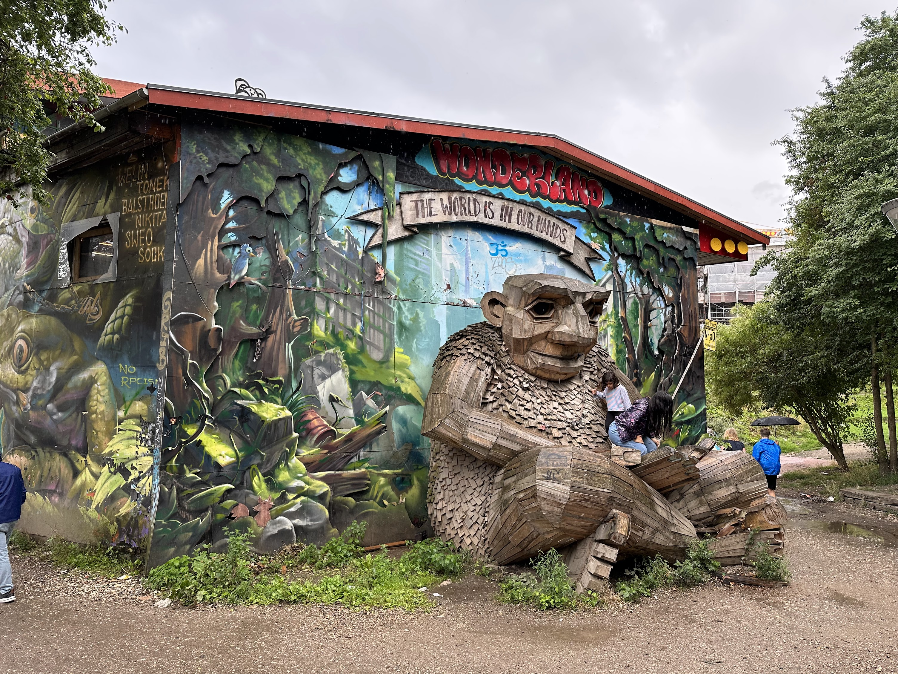<figcaption></figcaption></figure>

 

<figure>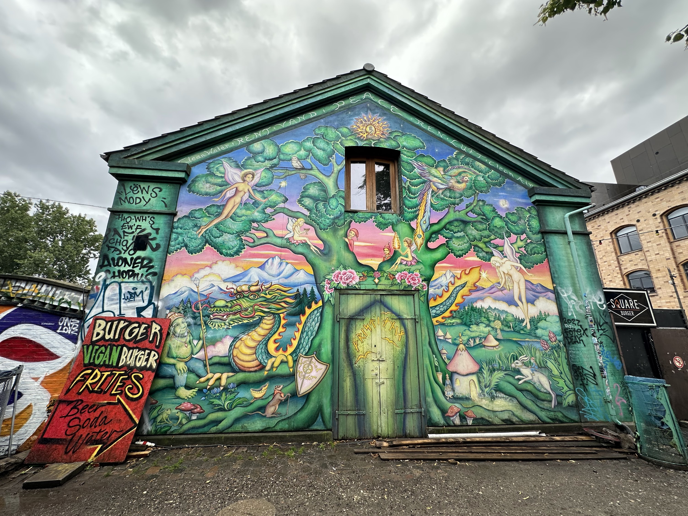<figcaption></figcaption></figure>

 

<figure>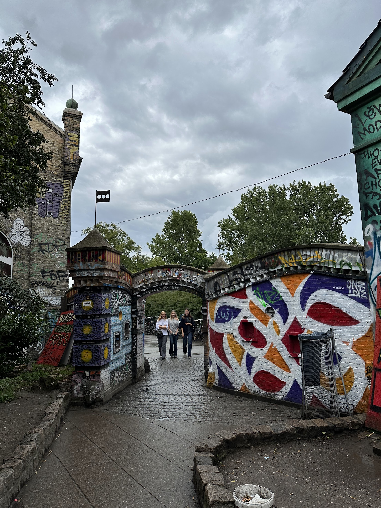<figcaption></figcaption></figure>

### Tivoli Garden

Opend in 1843, Tivoli Gardens is the worlds second-oldest amusement park. It's located right in the middle of Copenhagen so you really can't miss it. Admission is split between a basic entry fee and a variety of ride passes. It's also possible to pay for rides individually although it becomes cheaper to have a ride pass fairly quick. For reference their biggest rollercoaster, The Demon, costs 90 DKK without a ride pass.

<figure><figcaption></figcaption></figure>

 

<figure>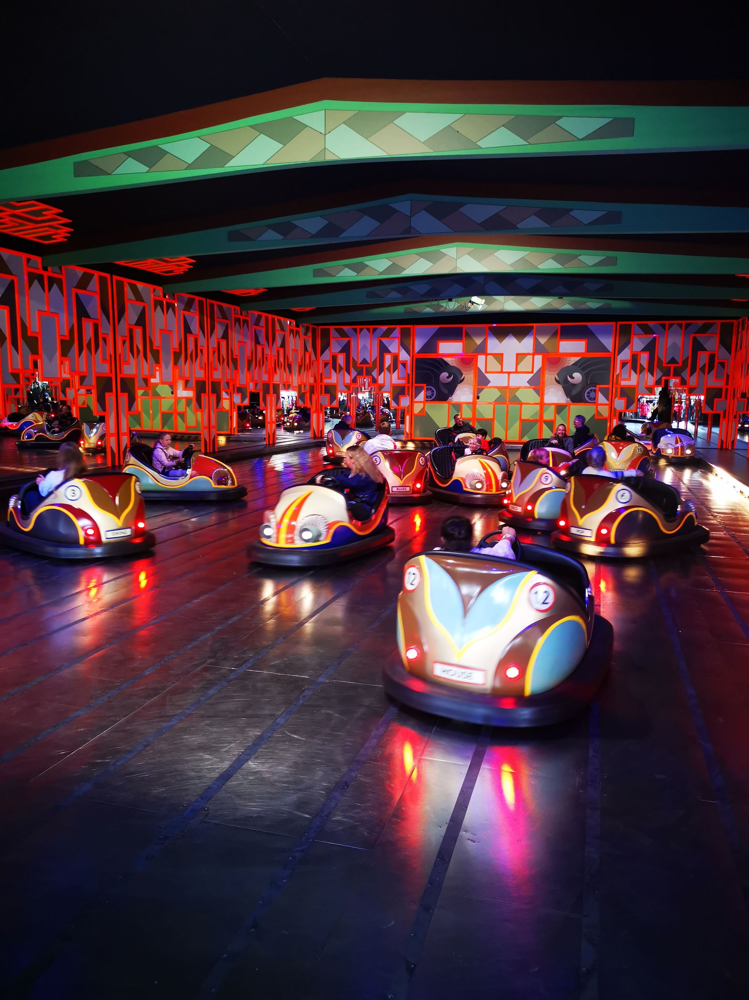<figcaption></figcaption></figure>

 

<figure><figcaption></figcaption></figure>

The park isn't gigantic and the rides are mostly of the carneval variety. But it is nicely maintained and good fun for spending half a day to a day. Since it's right in Copenhagen it's also possible to leave at any time and come back for the evening. Just be sure to get an exit stamp as you leave.

The park is open quite late, and it is totally worth to come back in the evening to take advantage of the shorter ride queues and to admire all the beautiful light installations. There's also a laser show over the little lake area and sometimes there are also concerts taking place inside Tivoli.

<figure>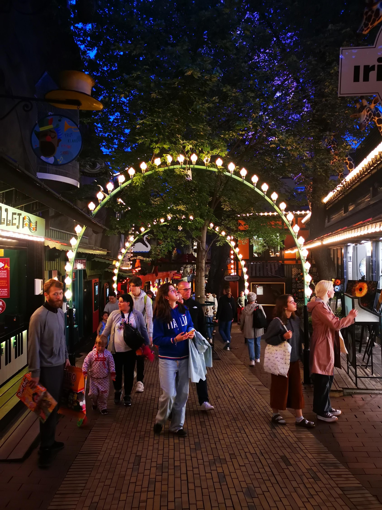<figcaption></figcaption></figure>

 

<figure>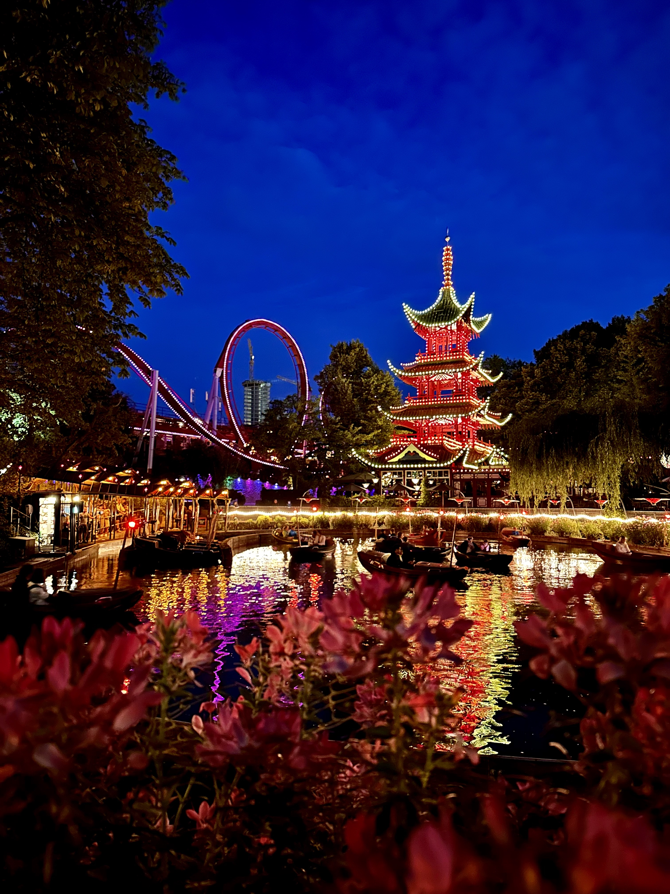<figcaption></figcaption></figure>

 

<figure>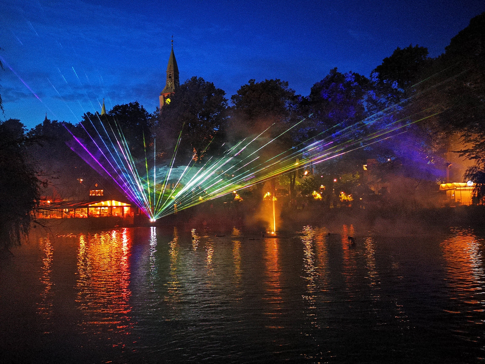<figcaption></figcaption></figure>

 

<figure>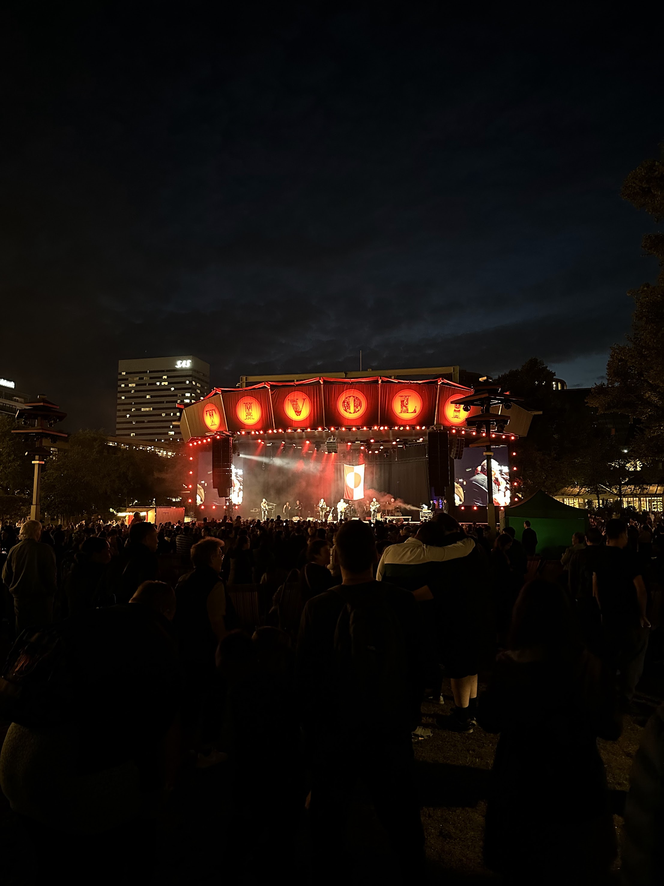<figcaption></figcaption></figure>

### Søndermarken Cisternerne

Beneath Søndermarken there is a former water reservoir that is now used as an exhibition space. While I was there in 2023 there was an exhibition by South Korean artist Kimsooja called "Weaving the light". Kimsooja uses light refracting sheets of glass that create wonderfully abstract images of rainbow colours. You can have a totally different experience depending on where you stand or how you move through the exhibition.

When visiting the cisterns it's a good idea to bringt a sweater or jacket, as it's fairly cool and damp down there.

<figure>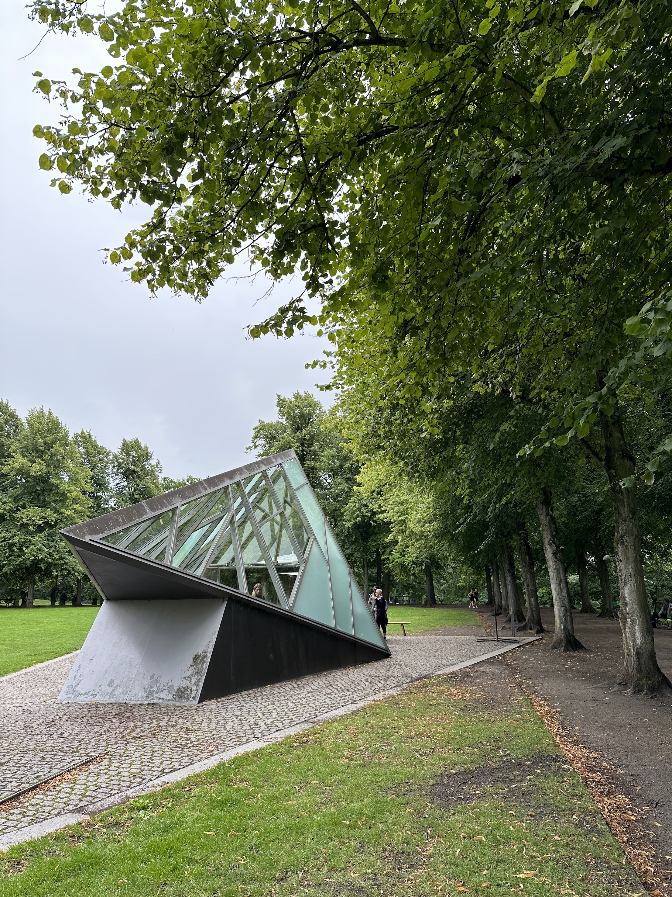<figcaption></figcaption></figure>

 

<figure><figcaption></figcaption></figure>

 

<figure>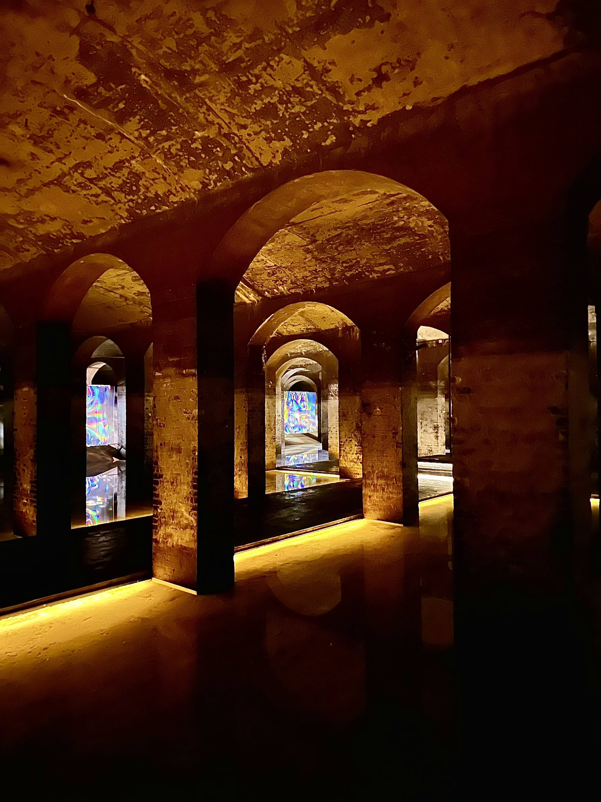<figcaption></figcaption></figure>

 

<figure><figcaption></figcaption></figure>

### Food & Drinks

* [**The Pescatarian**](https://thepescatarian.dk/home)\
  Fine dining, local, danish seafood experience. Has vegetarian option for all courses and can even be made vegan upon advanced request. Highly recommended.
* [**Vaekst**](https://cofoco.dk/en/vaekst)\
  Nordic menu with fresh vegetables and herbs. Restaurant is styled like a greenhouse with hanging plants everywhere. Great option for lunch or dinner.
* [**Brus**](https://tapperietbrus.dk/)\
  Awesome bar with a variety of IPAs and special beers on tap. There is plenty of seating inside and out. Be sure to try out the fermented fries! They're amazing!

## Notes

* [**Lego house**](https://legohouse.com/en-gb/): specially designed house, lego museum, occasionally sells specials lego sets that are only available there
