# 🇫🇮 Finland

## Rovaniemi

Rovaniemi, is the official hometown of Santa Claus and the capital of Lapland. Known for its unique Arctic Circle location, it combines urban life with close proximity to nature. This city offers a magical winter experience with opportunities for Northern Lights viewing, husky safaris, and reindeer rides. In summer, the Midnight Sun provides 24 hours of daylight for exploring the stunning landscapes. Cultural highlights include the Arktikum museum and the Santa Claus Village. Rovaniemi serves as a gateway to outdoor adventures in the surrounding Lappish wilderness.

<figure>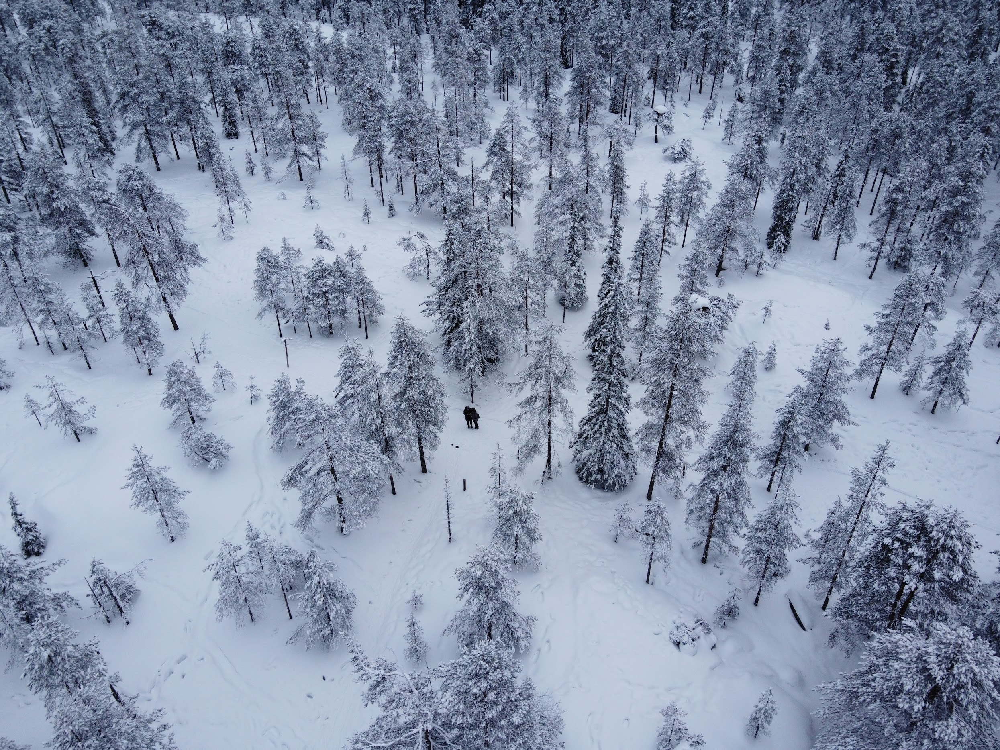<figcaption>
The view from Tottorakka lift station
</figcaption></figure>

 

<figure>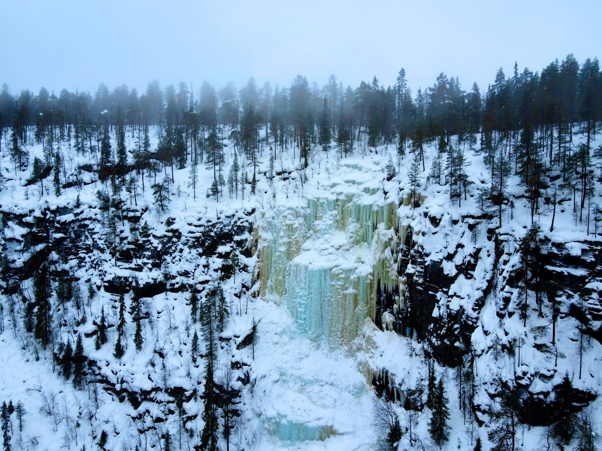<figcaption>
The waterfalls at Korouoma
</figcaption></figure>

 

<figure>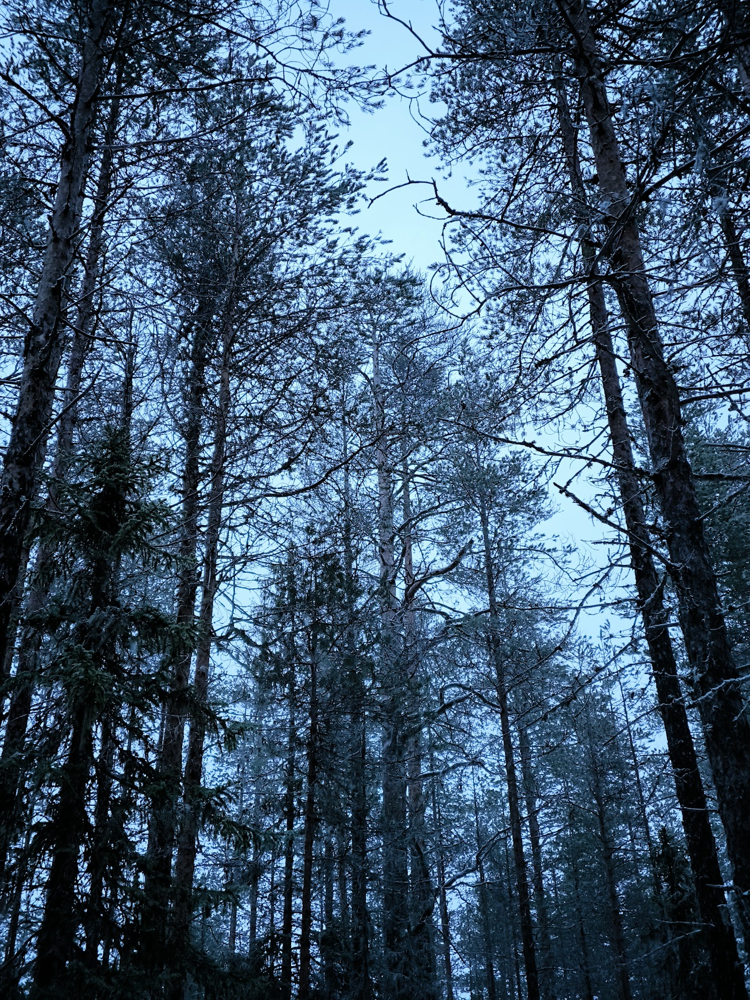<figcaption></figcaption></figure>

 

<figure>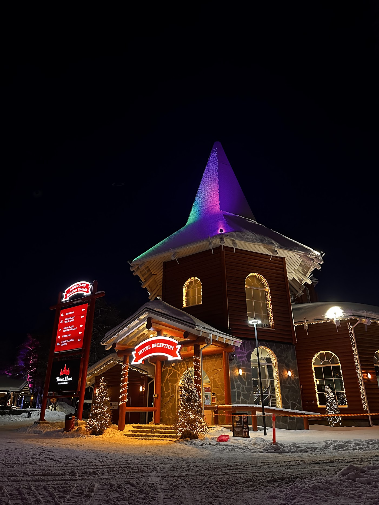<figcaption>
Santa Village
</figcaption></figure>

 

<figure>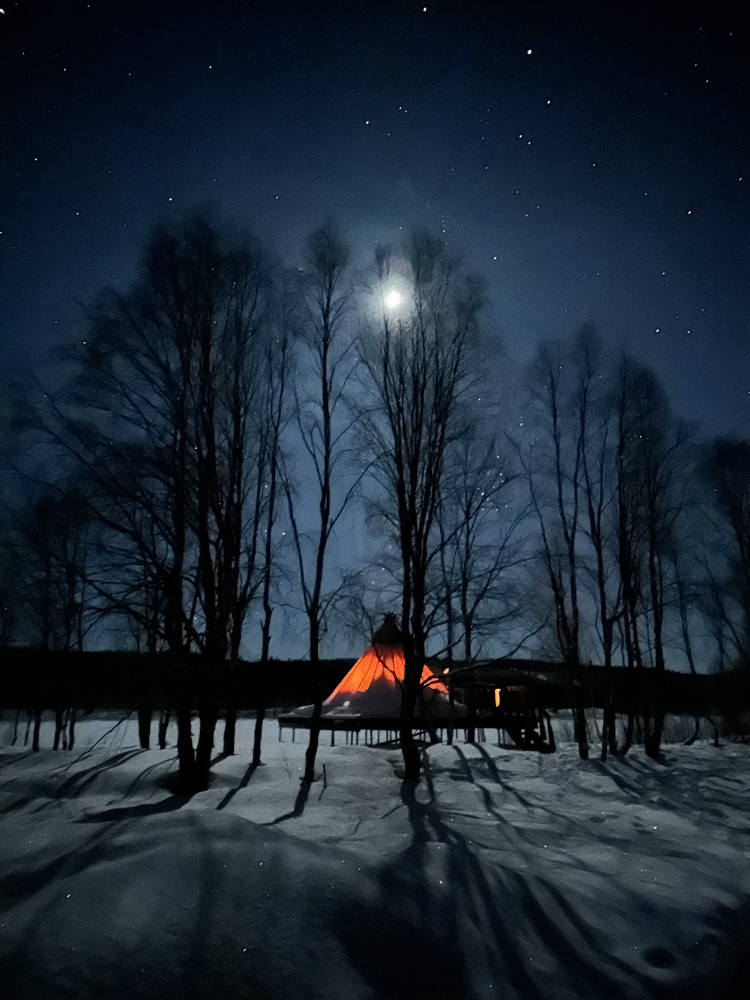<figcaption></figcaption></figure>

 

<figure>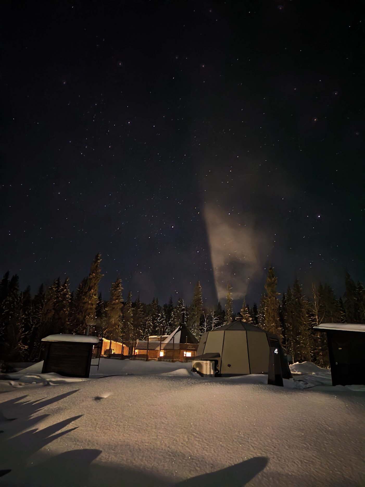<figcaption>
Nova Galaxy Village
</figcaption></figure>

## Luosto

Luosto, nestled in the heart of Finnish Lapland, offers a charming blend of winter activities and natural beauty perfect for adventure enthusiasts and tranquility seekers alike. This small yet captivating destination is renowned for its husky safaris, providing an authentic way to explore the snowy landscapes. For those looking to tread softly across the wintry terrain, snowshoe hiking offers a serene experience, allowing visitors to connect with the untouched nature. Luosto is also an ideal spot for watching the mesmerizing Northern Lights, with its clear, dark skies serving as a perfect canvas for this spectacular natural phenomenon.

<figure>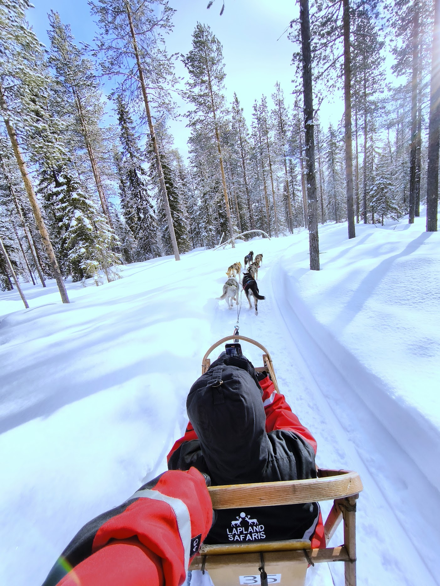<figcaption>
Husky safari in Luosto
</figcaption></figure>

 

<figure>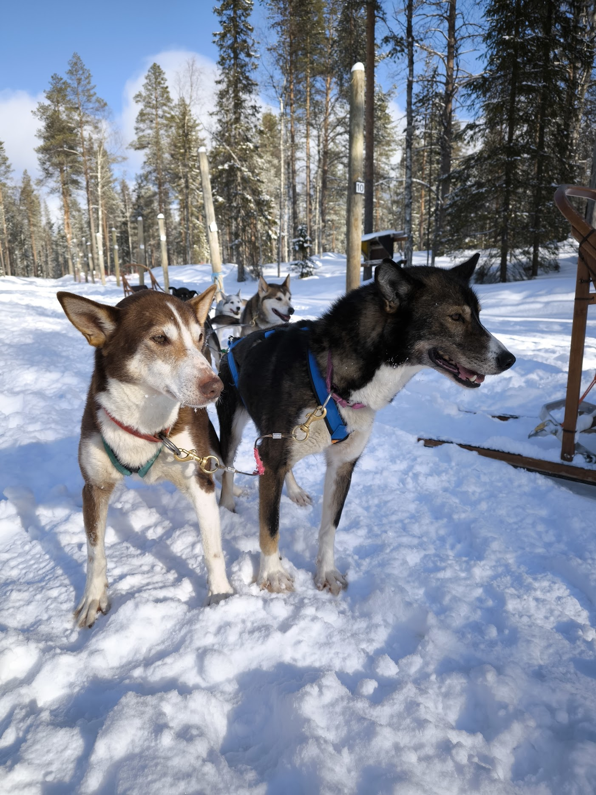<figcaption></figcaption></figure>

 

<figure>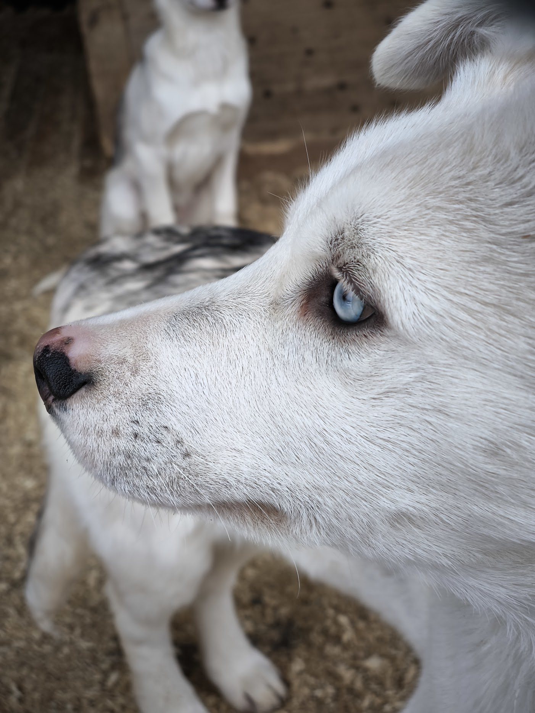<figcaption></figcaption></figure>

 

<figure>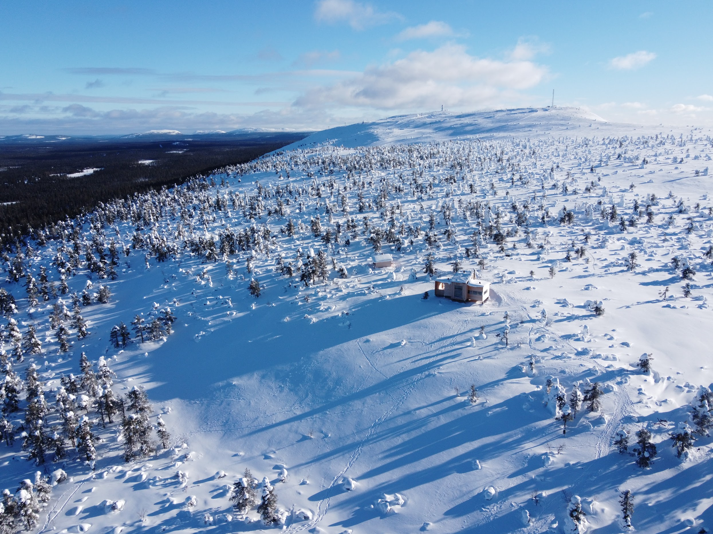<figcaption>
Luosto snowshoe hike
</figcaption></figure>

 

<figure>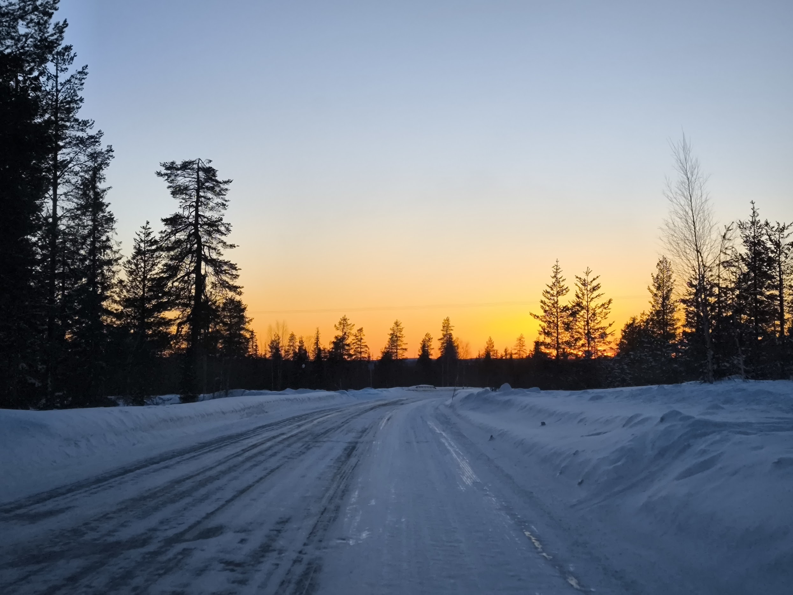<figcaption></figcaption></figure>

 

<figure>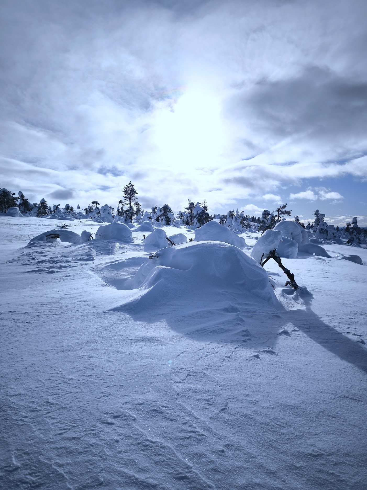<figcaption></figcaption></figure>

