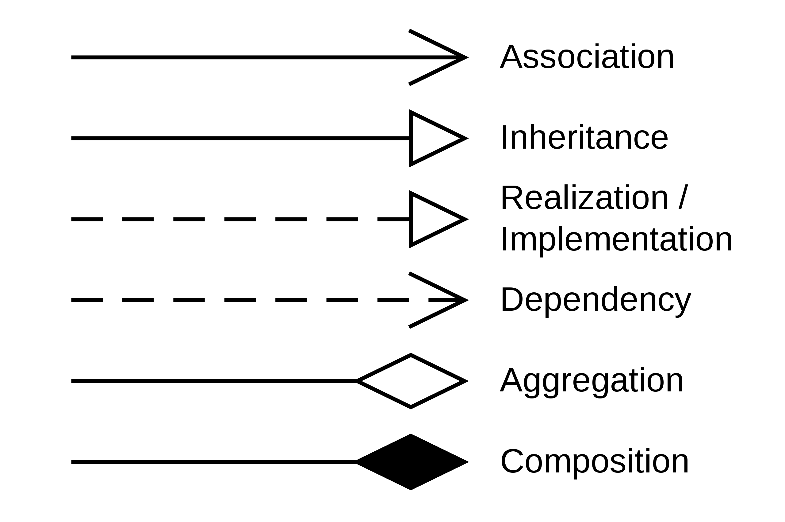

# 🇫🇷 France

## Paris

#### Getting around

Visiting all the points of interests in Paris is fairly easy thanks to the metro system. A single ride costs 1.9 euros but there's also the option to purchase a 2, 3 or 5 day pass. I opted for the 3 day pass which cost about 27 euros. So I'd have to ride 14 times to make the cost back.. but tbh just the convenience of not having to get a ticket every time is worth it. There's also the option of getting a multi ride ticket (10) for 16 euros. When staying longer it might be worth to get a Navigo card. When using the navigo card you can buy tickets on your phone and transfer them to the card via NFC. Sadly as of 2022 the Paris metro does not support fully phone based tickets nor Apple Wallet.

#### Metro Zones

Typically zones 1-3 are enough for anything within Paris itself. When visiting Versailles, the airport or Disneyland zones 4-5 are needed as well.

&#x20;

#### Credit card & mobile payment acceptance

Everywhere seems to support credit cards and mobile payments. I haven't had to use cash anywhere.

### Points of interest in Paris

#### [Le Louvre](https://www.louvre.fr/en)

Probably the worlds most famous museum. There's everything from famous painting such as the Mona Lisa to ancient greek and roman sculptures. Personally I don't like reading the little notes next to every object so I opted for the audio guide. The Louvre uses Nintendo 3DS for this purpose. It takes a bit of getting used to the controls but it works fairly well and the audio guide definitely adds a lot to the experience of otherwise static art pieces. It locates automatically the room you're in and you can then listen to a general overview of the room as well as info to some specific pieces. The descriptions are fairly to the point and interesting.

Getting to the Louvre is easy as there's a metro terminal underground directly connected to the Louvre. Alternatively you can also get out at Pyramides station if you have some time to kill before going into the museum.

It's important to buy the ticket online, then you can get in at a specific time without having a long wait. One thing to note is that there are two different queues for timed tickets at the glass pyramid. One is for all the half-hour time slots (e.g. 09:30, 10:30, 11:30) and the other for the full hour slots. Queuing at the right one is usually best ;-).

#### [Château de Versailles](https://en.chateauversailles.fr/)

The palace of Versailles was the seat of the french kings, court & government starting with the rein of Louis XIV until 1789. It's basically a big palace (Chateau de Versailles) with two smaller palaces (Le Grand Trianon, Le Petit Trianon) and a huge garden :sunglasses:... well multiple gardens really but all interconnected.

When going to Versailles from Paris by public transport it's necessary to get a tickets for zones 1-5 since it's outside of the regular city zone (1-3). I took the C-train from Saint-Michel Notre Dame to Versailles Château Rive Gauche. The ride takes about 30 minutes. Btw. it's important to keep the ticket on these 1-5 zones trains as you're usually required to scan it on the exit turnstile as well. Which is different from the metro lines (1-3) where you just exit. Lastly it's a good idea to get a return ticket ahead of time.. as there's usually a wait in the end of the day with all the tourists trying to buy tickets back to Paris. I had to do this as well as I couldn't figure out how to buy the return ticket on the machine in Paris :see\_no\_evil:. On the plus side the machines on the station in Versailles accept contactless payments so it was super easy to buy a return ticket once I actually got to through the queue at the machine..

Before going to Versailles I was wondering whether it's actually worth it or if it's better to just spend the day in Paris. I think it definitely is. The castle is really nice & the audio guide (which is just an app that you can download ahead of your visit) is very well made. I think it's a much better audio guide then the Nintendo 3DS system at the Louvre. With an iPhone and Airpods you've got your hands free and it's very convenient to just tap on the next room if you're moving ahead faster. Do download the app on Wifi though if you're short on roaming data.

There's several ticket options to go to Versailles. The basic one only includes the main Chateau. The garden are free on a no-fountains day. The passport ticket includes the gardens on fountains days (meaning the fountains are activated) and also access to the Grand and Petit Trianon as well as the queens hamlet. I went for the passport ticket as it's only slightly more expensive and it was totally worth it. I liked the gardens outside the main Chateau but I absolutely loved the garden by around the Petit & Grand Trianon. It's a bit of a walk to get out there but definitely a must-see. The queens gardens out there are a lot more "natural" feeling.. I mean they're completely artificially made and maintained but where the main gardens are all big roads & angular lines, the queens gardens are more rounded with small pathways and little hidden tracks & benches. There's a new sight around every corner. Also the queens hamlet, which is basically a really upscale farm that the queen used to hang out around to feel like a commoner, it just looks a bit like a hobbit village or something out of a fantasy movie.

So overall, totally loved it. If you've got half a day or a day. Versailles is great.

* Tour d'eiffel
* Louvre
* catacombs

## Notes

* [The Do’s, Don’ts, and Maybes of Mont Saint Michel](https://habitsofatravellingarchaeologist.com/the-dos-donts-and-maybes-of-mont-saint-michel/)
