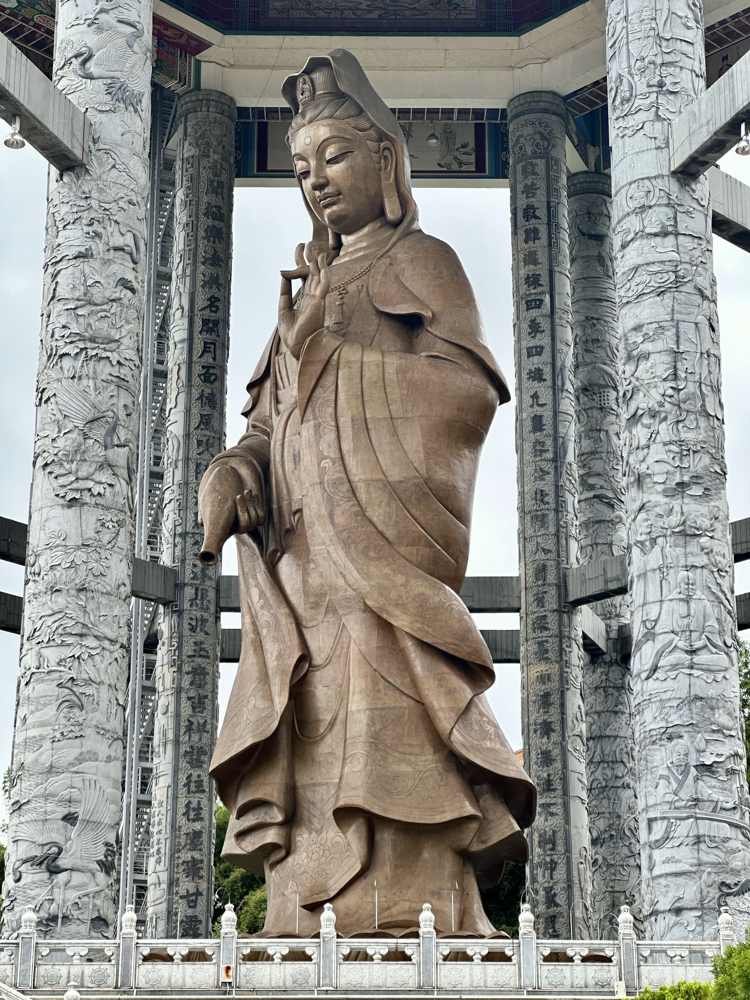

# 🇲🇾 Malaysia

## George Town, Penang

George Town, the capital city of the Malaysian state of Penang, is a UNESCO World Heritage site celebrated for its historic colonial architecture, intricate temples, and mosques. The city is a melting pot of diverse cultural influences, notably Chinese, Indian, and Malay, which is most evident in its eclectic cuisine, festivals, and vibrant street art.

### Food halls & bar street

In George Town, the lively food courts and bar streets offer a gastronomic paradise featuring local and international flavours. The bar streets contribute to a vibrant nightlife. Alcohol is widely available. However, it is more expensive due to Malaysia being a Muslim-majority country.

<figure><figcaption>
Vibrant food court with a huge variety of tasty dishes
</figcaption></figure>

 

<figure><figcaption></figcaption></figure>

 

<figure><figcaption>
lively bars can be found easily
</figcaption></figure>

 

<figure><figcaption>
interactive street art invites you to take tons of photos
</figcaption></figure>

### Botanical gardens

The Botanical Gardens offer a lush and serene escape from the city, featuring a wide array of local flora, scenic walking paths, tranquil ponds, and cheeky monkey sightings.

<figure><figcaption></figcaption></figure>

 

<figure><figcaption></figcaption></figure>

 

<figure><figcaption></figcaption></figure>

 

<figure><figcaption></figcaption></figure>

### Kek Lok Si Temple & Guan Yin Statue

The Kek Lok Si Temple is a sprawling complex with intricate Chinese-inspired architecture and vibrant Buddhist murals, serving as a significant spiritual center. In close proximity, the Guan Yin Statue, influenced by Chinese art and spirituality, is a towering monument made of bronze. It serves as a symbol of compassion and mercy, characteristics associated with the Bodhisattva Guan Yin in Buddhist tradition. The statue is often a focal point for pilgrimages and ceremonies, and its elevated position offers panoramic views of the surrounding landscape.

<figure><figcaption>
Kek Lok Si Temple
</figcaption></figure>

 

<figure><figcaption></figcaption></figure>

 

<figure><figcaption>
scenic view of Georg Town
</figcaption></figure>

 

<figure><figcaption></figcaption></figure>

 

<figure><figcaption></figcaption></figure>

 

<figure><figcaption></figcaption></figure>

 

<figure><figcaption>
Giant Guan Yin Statue
</figcaption></figure>

## Chew Jetty

Chew Jetty is a historic waterfront settlement in Penang consisting of wooden stilt houses, built by the Chew clan from China's Fujian province. The area is a living testament to early Chinese migration to Malaysia, offering a unique blend of culture, art, and community, with shops and homes sitting above the water.

<figure><figcaption></figcaption></figure>

 

<figure><figcaption>
Hokkien Char was delicious 
</figcaption></figure>

 

<figure><figcaption></figcaption></figure>

 

<figure><figcaption>
I also statisfied my new found love of Durian with some home-made Durian ice cream 😋
</figcaption></figure>

 

<figure><figcaption></figcaption></figure>

## Cameron Highlands

Cameron Highlands is a notable destination for its sprawling tea plantations, strawberry farms, and the ethereal Mossy Forest, offering a blend of agricultural richness and natural beauty.

<figure><figcaption>
BoH tea plantation
</figcaption></figure>

 

<figure><figcaption></figcaption></figure>

 

<figure><figcaption>
strawberries at the markets
</figcaption></figure>

 

<figure><figcaption></figcaption></figure>

 

<figure><figcaption>
carnivorous plants in the wild.. H* thinks they look like condoms 🤭😆 
</figcaption></figure>

 

<figure><figcaption></figcaption></figure>

 

<figure><figcaption></figcaption></figure>

## Kuala Lumpur

Kuala Lumpur, the capital of Malaysia, is a bustling metropolis known for its iconic skyline dominated by the Petronas Twin Towers, a rich mix of cultural influences, and a vibrant food and shopping scene.

<figure><figcaption></figcaption></figure>

 

<figure><figcaption>
Asam Laksa with Bandung Longan drink
</figcaption></figure>

 

<figure><figcaption></figcaption></figure>

 

<figure><figcaption></figcaption></figure>

 

<figure><figcaption></figcaption></figure>

Just like in George Town there is also tons of street art to marvel at. But another highlight of KL are of course the Petronas Towers at night. There's also a water/light show called "[Lake Symphony](https://www.suriaklcc.com.my/attractions/esplanade-lake-symphony)" happening every night at KLCC park. For the best view of the Petronas Towers it's best to go to one of the sky bars just across the park. (e.g. [SkyBar](https://maps.app.goo.gl/qySmxY35m5Zeviv46))

<figure><figcaption>
Lake Symphony at KLCC park
</figcaption></figure>

 

<figure><figcaption>
a shot from below at KLCC park
</figcaption></figure>

 

<figure><figcaption>
for the best view go to one of the sky bars opposite of the Petronas Towers
</figcaption></figure>

### Batu Caves

The Batu Caves are a Hindu pilgrimage site near Kuala Lumpur featuring a towering limestone hill and ornate cave temples. A 272-step climb leads to the main Cathedral Cave. But be alert; the local macaque monkeys are known for swiping unguarded snacks!

<figure><figcaption></figcaption></figure>

 

<figure><figcaption></figcaption></figure>

 

<figure><figcaption></figcaption></figure>

 

<figure><figcaption></figcaption></figure>

 

<figure><figcaption></figcaption></figure>

 

<figure><figcaption></figcaption></figure>

 

<figure><figcaption></figcaption></figure>

## Malacca

Malacca, also known as Melaka, is a historic city in Malaysia that is a UNESCO World Heritage Site, distinguished for its colonial-era architecture and complex history involving Portuguese, Dutch, and British rule, which has left an indelible impact on its culture and landmarks.

<figure><figcaption></figcaption></figure>

 

<figure><figcaption></figcaption></figure>

 

<figure><figcaption></figcaption></figure>

 

<figure><figcaption></figcaption></figure>

 

<figure><figcaption></figcaption></figure>

 

<figure><figcaption></figcaption></figure>

