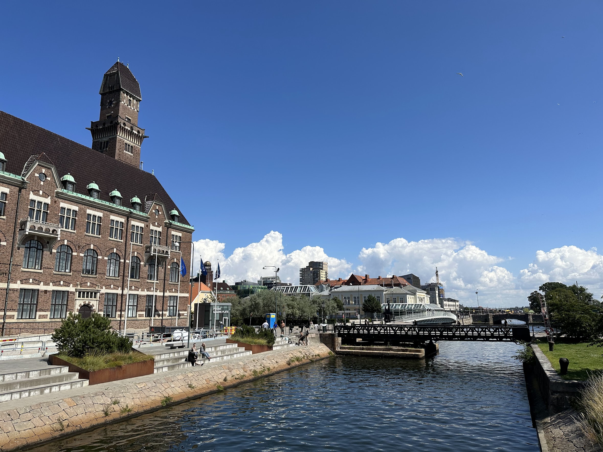
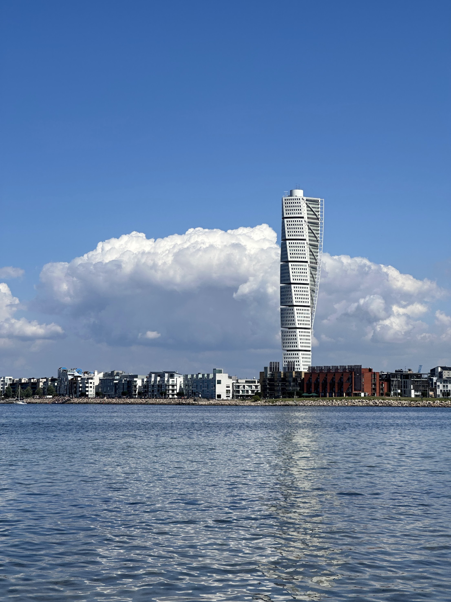
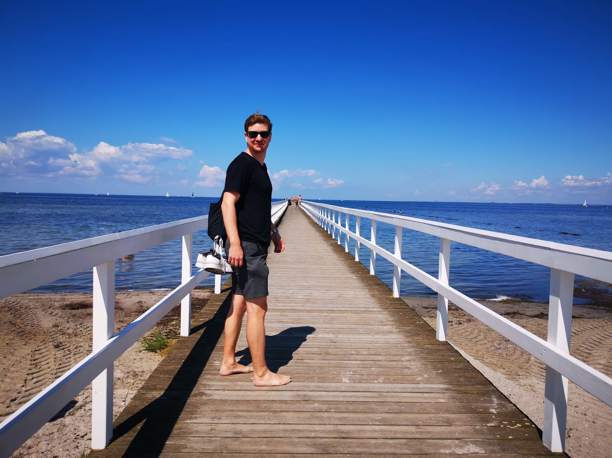
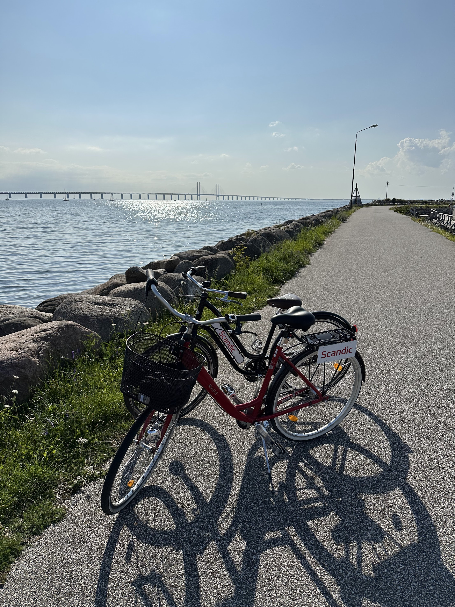
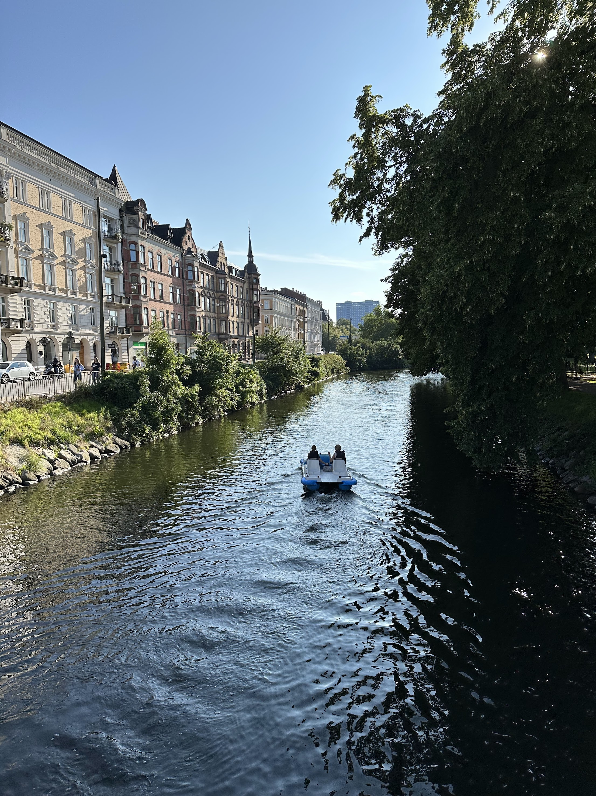
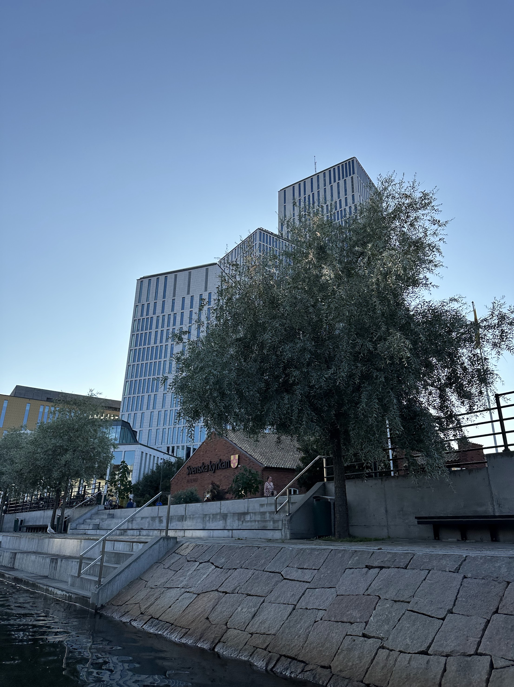
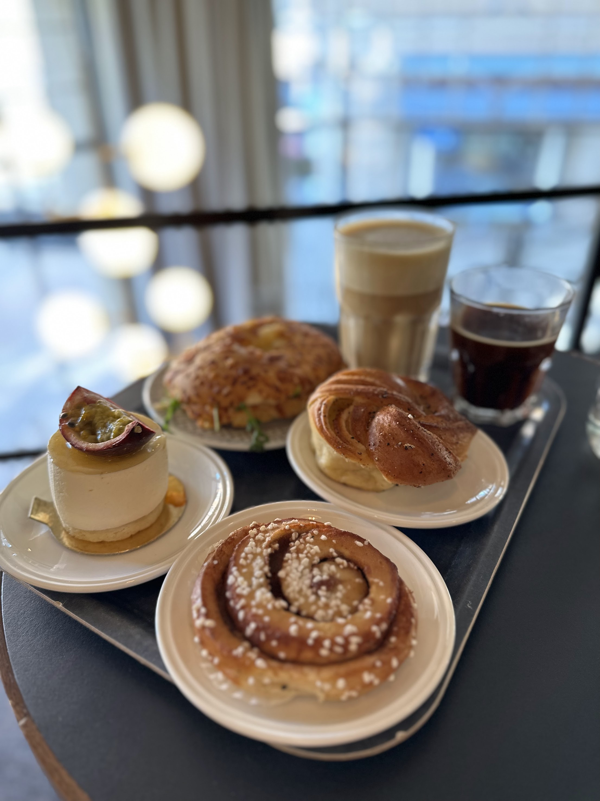
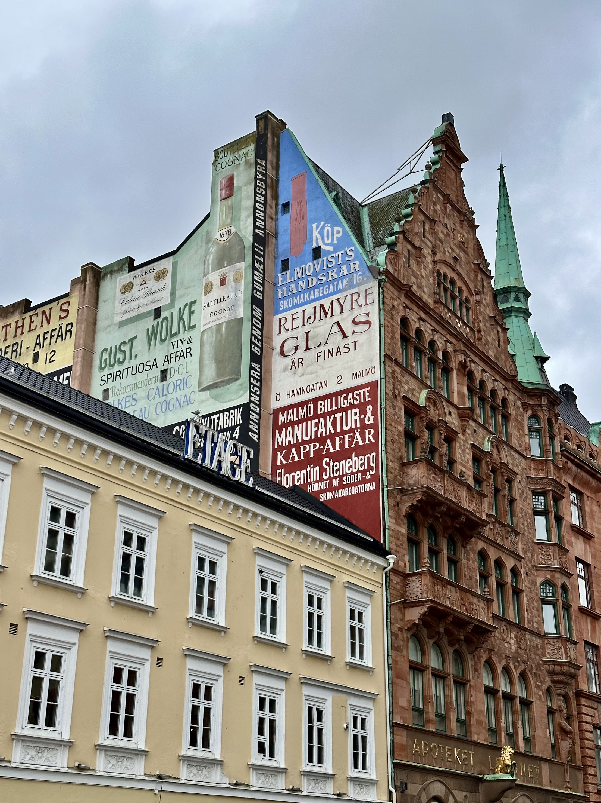
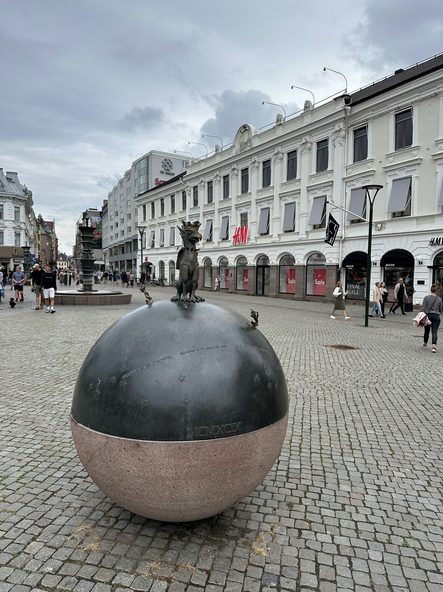

# 🇸🇪 Sweden

## Malmö

Malmö is a coastal city in southern Sweden. It lies just across from Copenhagen and can be reached easily by train going over the Örsund Bridge.&#x20;

When it's sunny it can be a nice excursion to cycle out to the various viewpoints on the coast.

<figure><figcaption></figcaption></figure>

 

<figure><figcaption></figcaption></figure>

 

<figure><figcaption></figcaption></figure>

 

<figure><figcaption></figcaption></figure>

The city of Malmö itself is also very cycle friendly with dedicated bike lanes and traffic lights. Another thing to do in Malmö is to rent a pedalo and cruise around the many canals.

<figure><figcaption></figcaption></figure>

 

<figure><figcaption></figcaption></figure>

 

<figure><figcaption></figcaption></figure>

Also if you've got some time to kill be sure to look around the many little shops. One really cool place is the [Sci-Fi book store](https://goo.gl/maps/WZz9JKDsRTnM7zydA). They've got soooo many cool books.

<figure><figcaption></figcaption></figure>

 

<figure><figcaption></figcaption></figure>

 

<figure><figcaption></figcaption></figure>

## Interesting Locations

* Visby
  * [Medieval city which has weeklong medieval festival in August every year](https://www.youtube.com/watch?v=zAkctTb6GAI)
