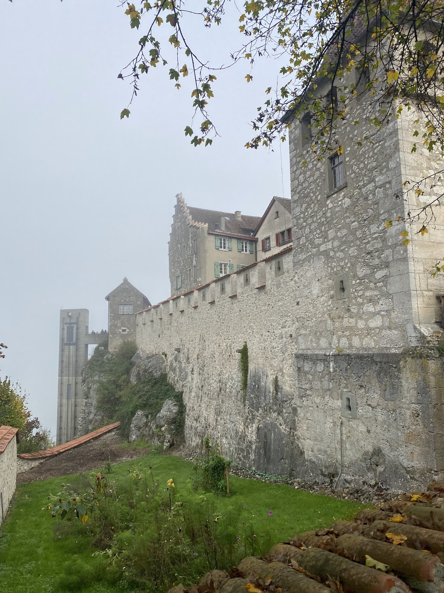
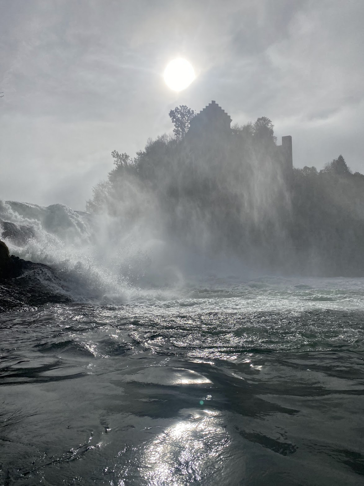
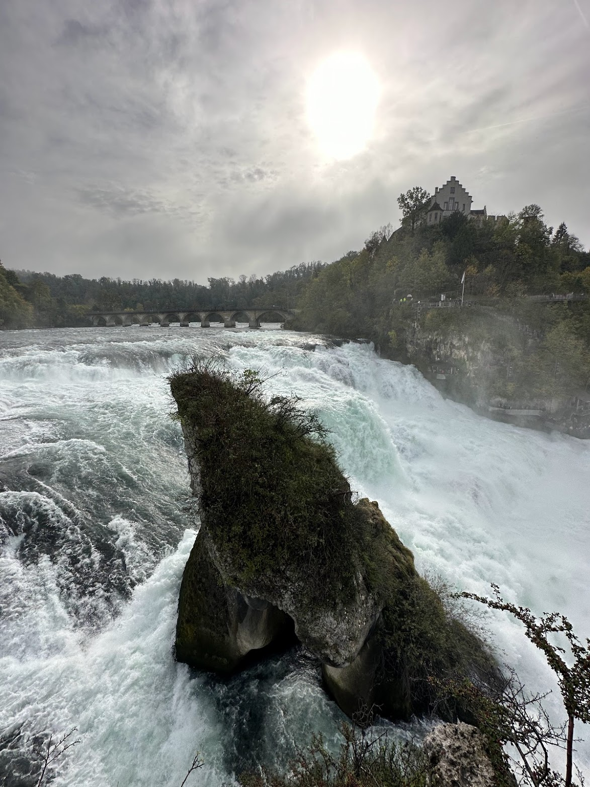
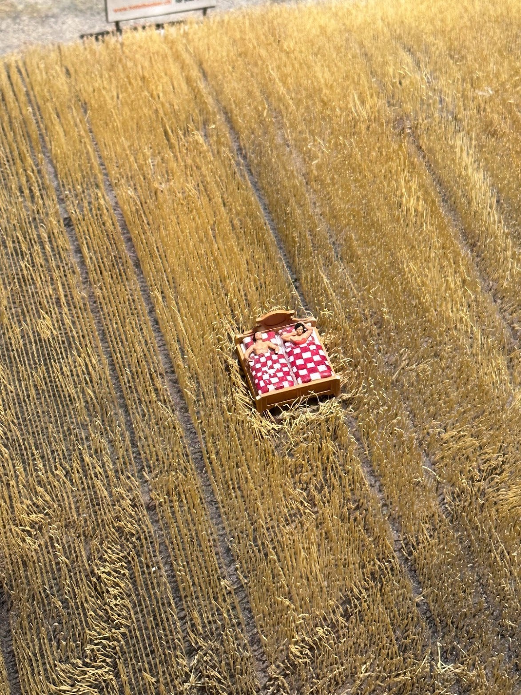
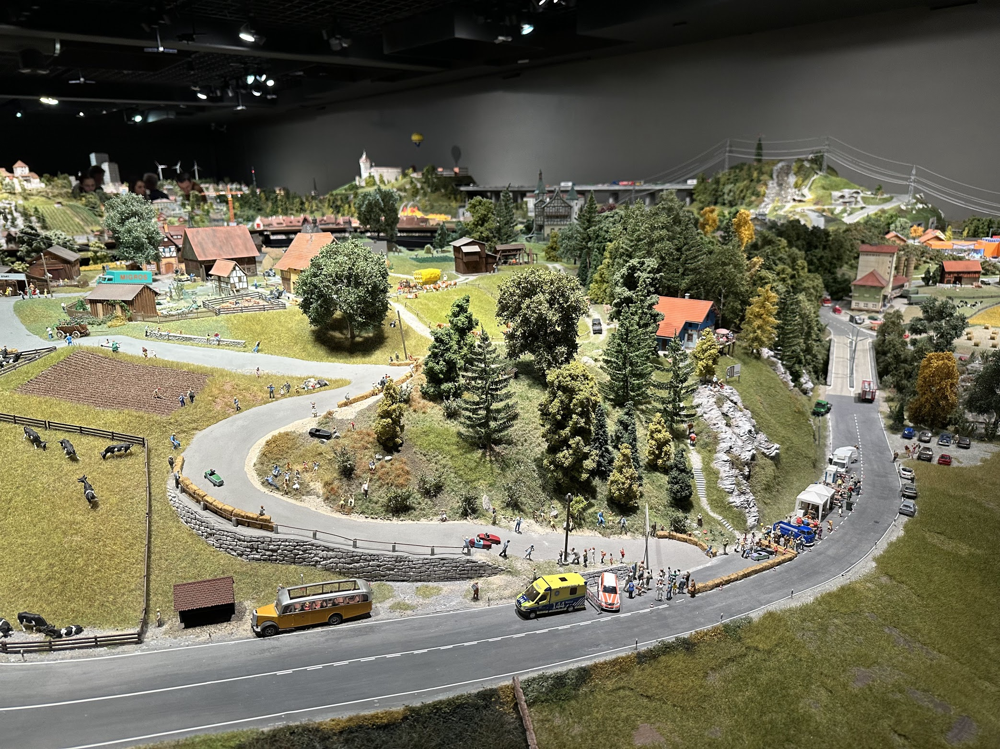
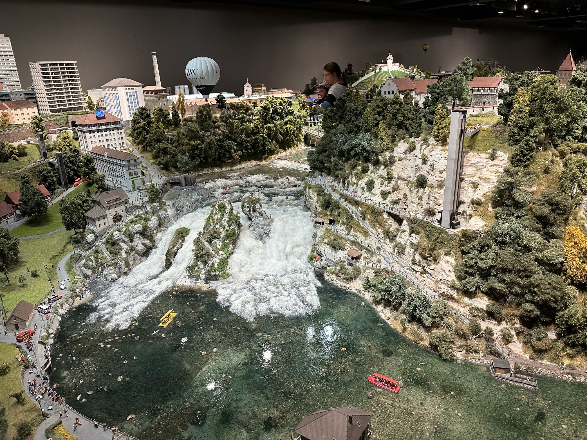

# 🌊 Rheinfall

Rheinfall is one of the tourist places easily accessible from Zurich. It's a big waterfall with a castle and some touristic infrastructure around it. But even so it's a nice place to visit. Arriving by train is easy, there's a station "Schloss Laufen" right by the castle overlooking the Rheinfall. This is also the last station that's still in the ZVV zone network (cheaper fares depending on the ticket).

<figure><figcaption>
Schloss Laufen
</figcaption></figure>

 

<figure><figcaption>
Schloss Laufen from a boat
</figcaption></figure>

 

<figure><figcaption>
View from the middle island
</figcaption></figure>

A lot of stuff around the Rheinfall costs money, but in my opinion it's worth it to do it once. There's a small entrance fee for the castle and the viewing platforms leading down to the river (5CHF). The castle has audio guided attractions inside, I didn't find it super interesting, but it may be a nice place to stay a bit if it's cold or foggy outside. The viewing platforms outside are already worth the 5 bucks.

When you arrive at the river below you can take a boat across or to the little island in the middle of the waterfall. I recommend doing this at least once, it's quite an experience and the view from the middle is really cool. When getting a ticket to visit the little island a ticket to cross the river is included. Beware that the stairs on the little island are quite narrow and you need good mobility to get up to the viewing spot.

<figure><figcaption></figcaption></figure>

 

<figure><figcaption>
Smilestones miniature Switzerland
</figcaption></figure>

 

<figure><figcaption></figcaption></figure>

On the other side of the river there are restaurants (takeaway and regular) as well as some more attractions. If you walk up to the village you can also visit Smilestones, which has miniature models of various places in Switzerland with little trains and cars driving on the roads. It's quite nice, even for adults as there are a lot of secrets and little memes hidden in the models. For example you can look for all the naked people ;-).
