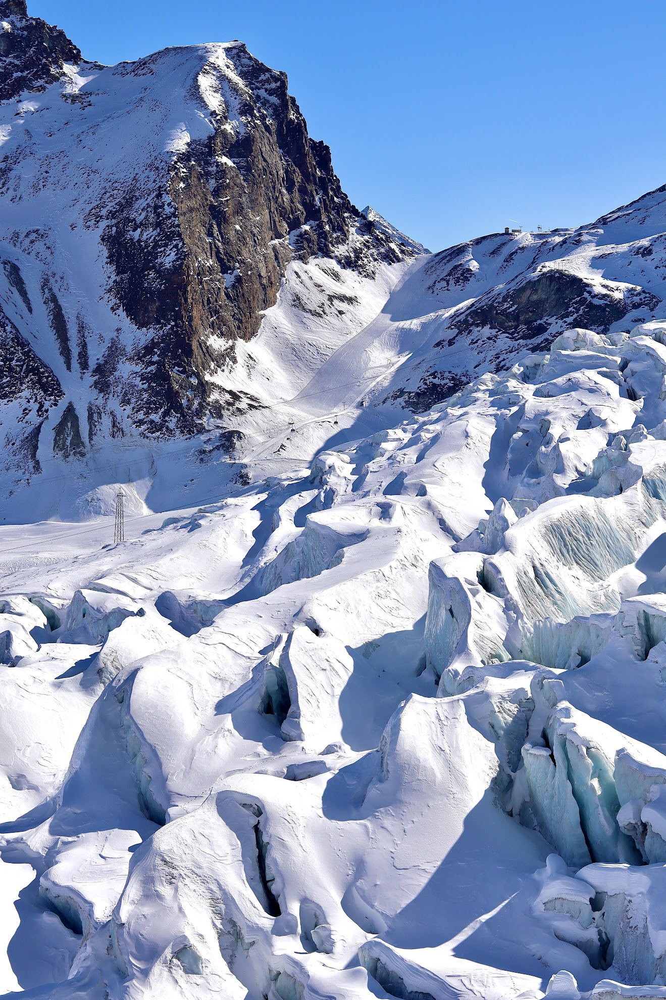
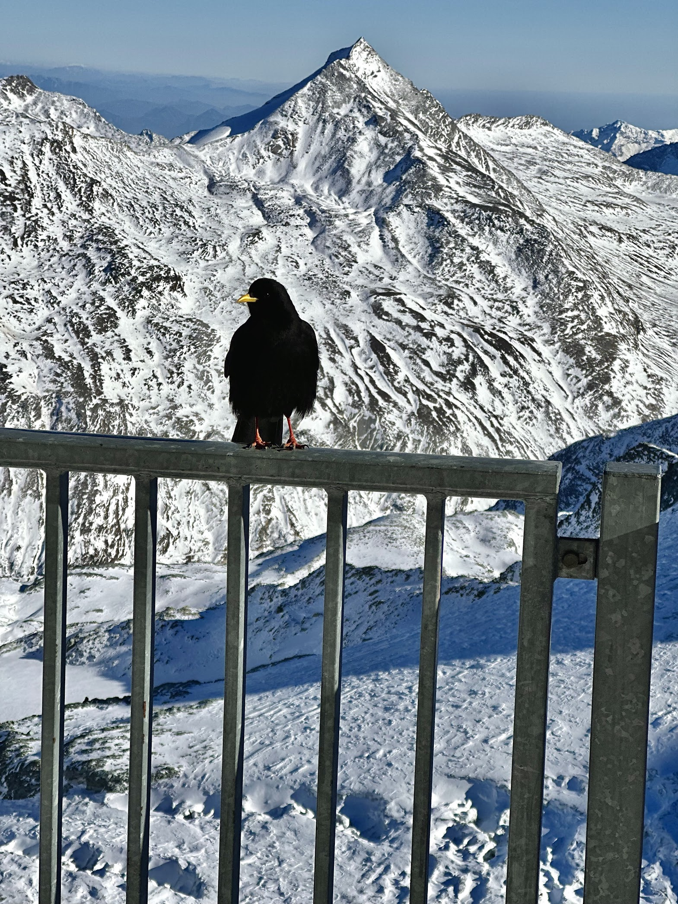
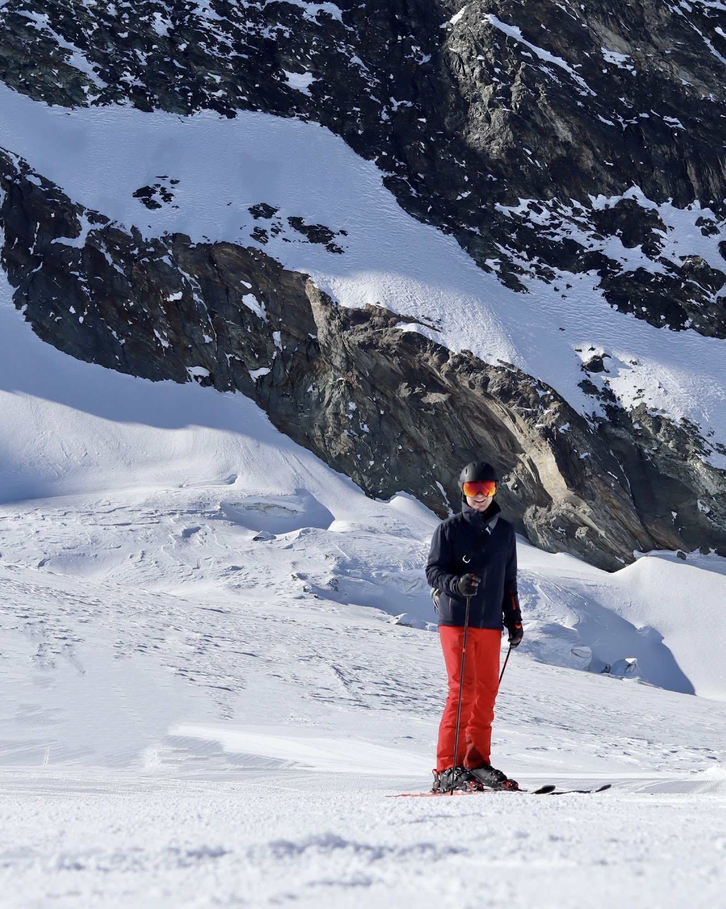
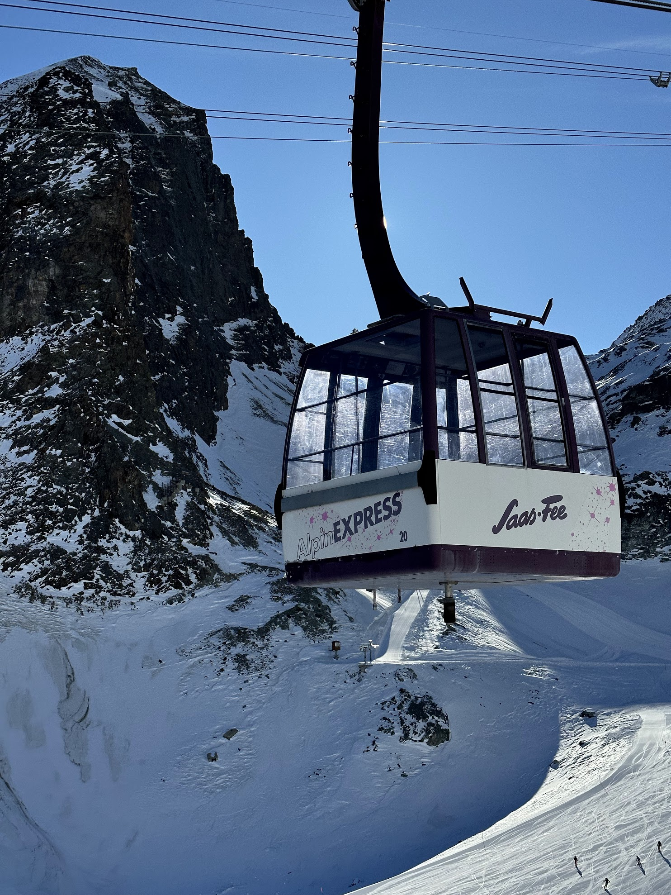

# ☃ Saas Fee

* The village itself is free of cars and there is a big parking structure at the entrance to Saas Fee where you're required to leave your car.
* It's also possible to stay in the villages Saas Grund or Saas Almagell which are slightly below Saas Fee. These villages have their own ski lifts but there is also a regular bus service that takes skiers quickly up to Saas Fee. The bus connection is fairly convienent, although you're required to switch to a special electric bus when arriving in the village of Saas Fee due to the no cars rule. The bus service is generally free via a special tourism card if you're staying in one of these villages.
* The ski slopes around Saas Fee are amazing and are guaranteed to have good snow conditions due to their elevation. When riding all the way to the top you can also get good views of the glacier.

<figure><figcaption></figcaption></figure>

 

<figure><figcaption></figcaption></figure>

 

<figure><figcaption></figcaption></figure>

 

<figure><figcaption></figcaption></figure>

