# 🇹🇭 Thailand

## Bangkok

Bangkok is Thailand's vibrant capital city, known for its ornate temples, bustling street markets, and modern skyscrapers.

### Wat Arun

Wat Arun, often referred to as the "Temple of Dawn," is an architectural marvel adorned with intricate ceramic and porcelain details, rising elegantly against the backdrop of the Chao Phraya River.

<figure>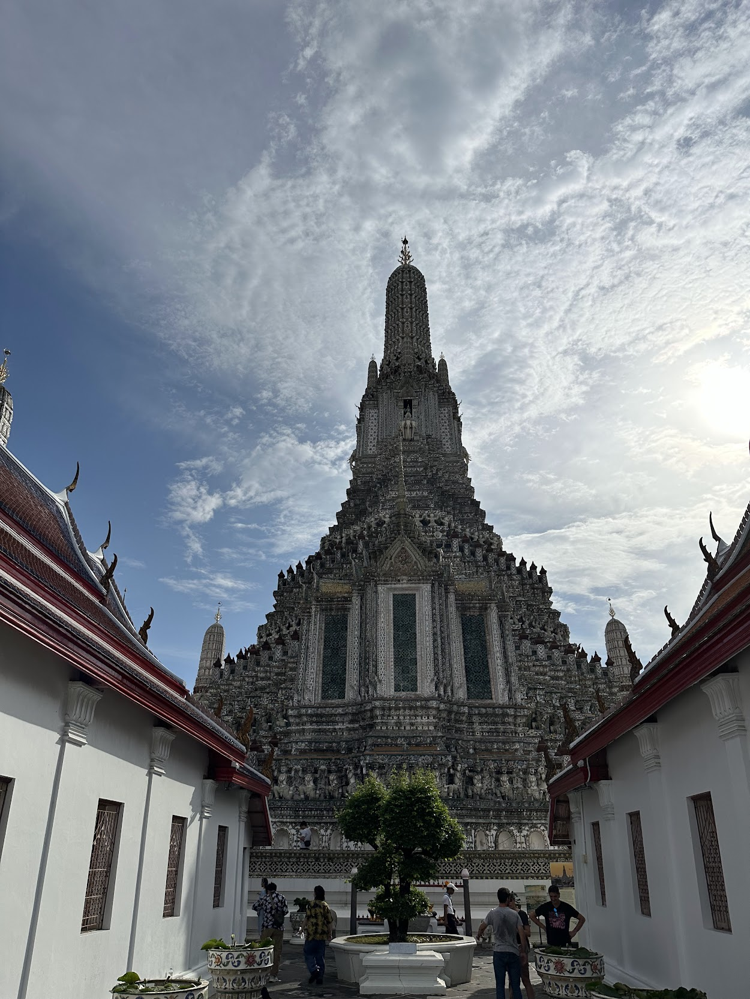<figcaption></figcaption></figure>

 

<figure>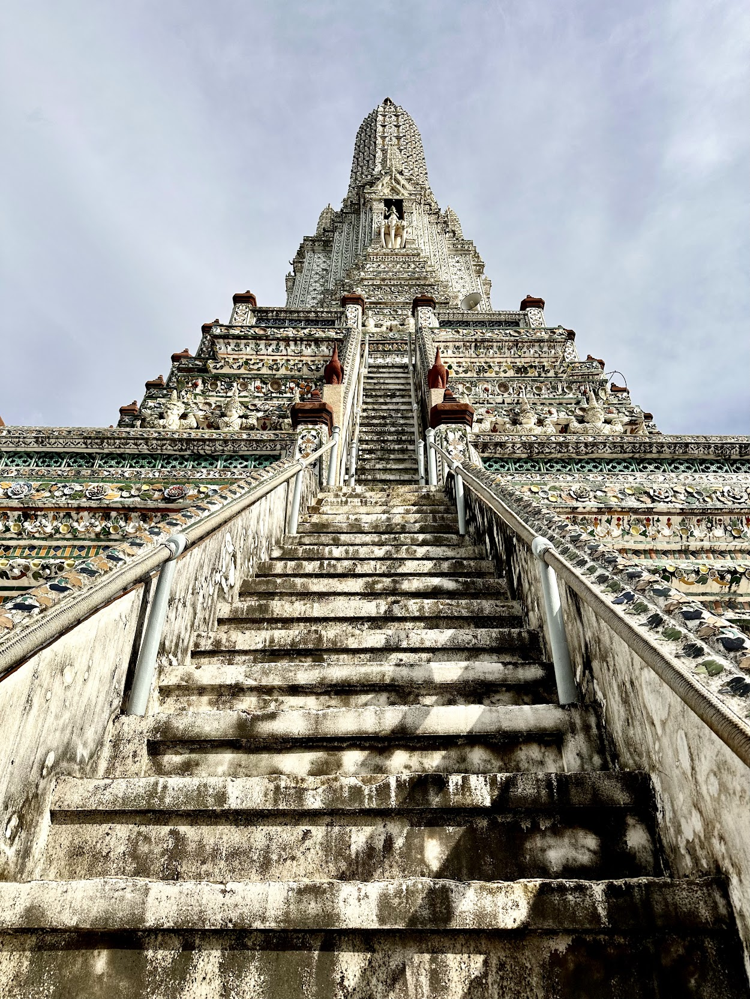<figcaption></figcaption></figure>

 

<figure>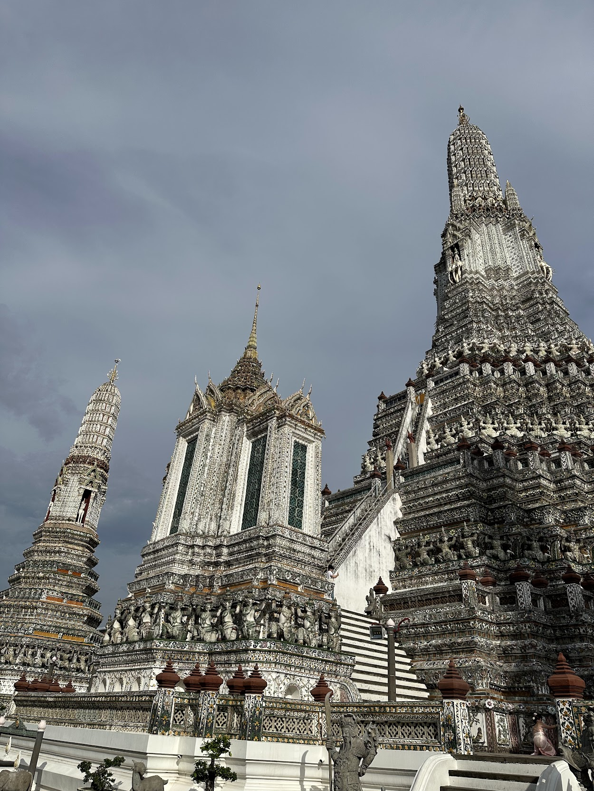<figcaption></figcaption></figure>

There's a tiny entrance fee (something like 100 thb) to enter Wat Arun, but you also get a "free" bottle of water with it, so totally worth it 😄. In front of Wat Arun there's also a ferry terminal with connections to many other ports on the river. If you can, try to go near sunset to also see it lit up at night.

### Wat Paknam

Wat Paknam is a notable temple in Thailand, home to a towering white pagoda and a striking giant Buddha statue, embodying a blend of modern and traditional designs.

<figure>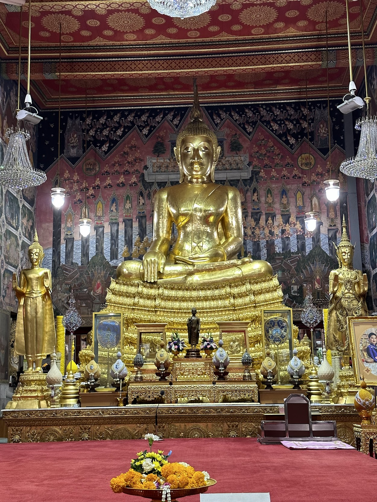<figcaption>
inside the temple
</figcaption></figure>

 

<figure>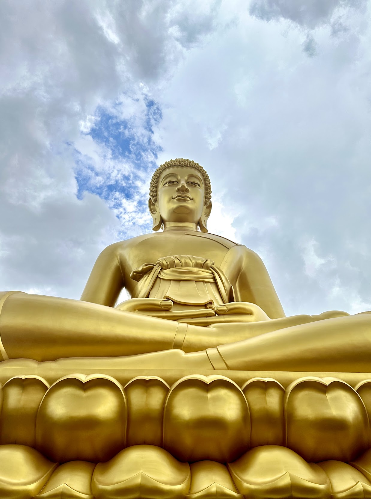<figcaption>
a nice crop of the giant Buddha
</figcaption></figure>

 

<figure>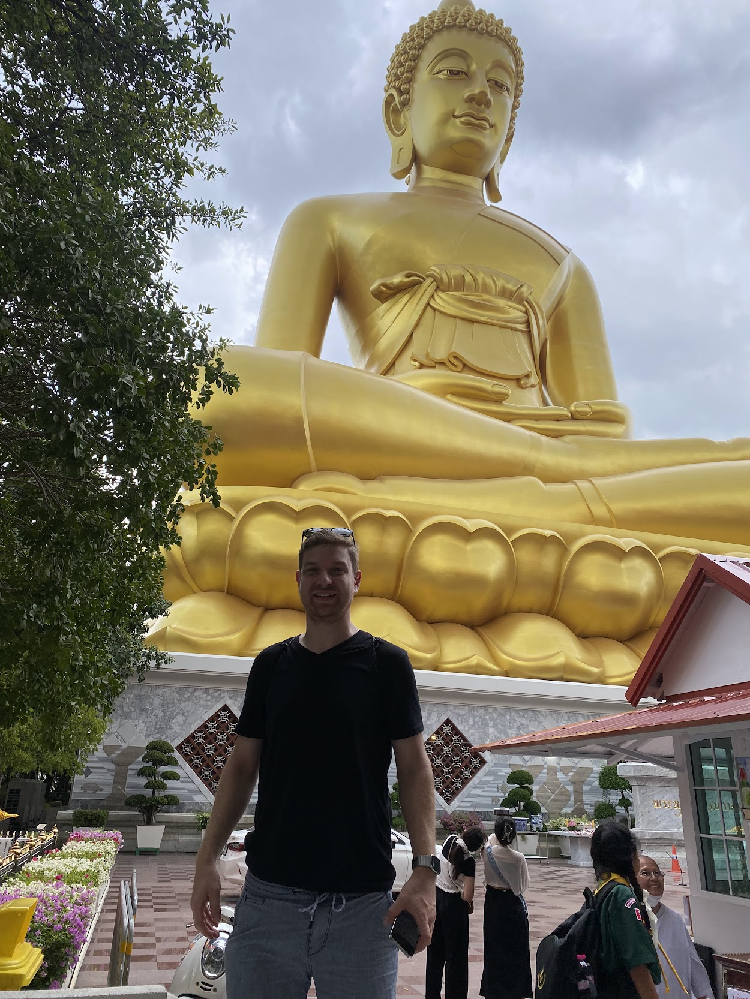<figcaption>
selfie for scale 😄
</figcaption></figure>

### Khlong Bang Luang Floating Markets

The Khlong Bang Luang Floating Markets are a charming network of canals near Bangkok, where traditional boats laden with fresh produce, local crafts, and colorful textiles offer a glimpse into Thailand's vibrant cultural tapestry. The market is not "active" all the time, so beware of the local schedule. There are however also houses on stilts with little shops in them that you can visit.

<figure>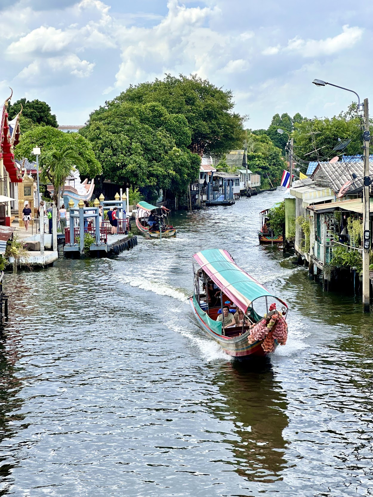<figcaption></figcaption></figure>

 

<figure>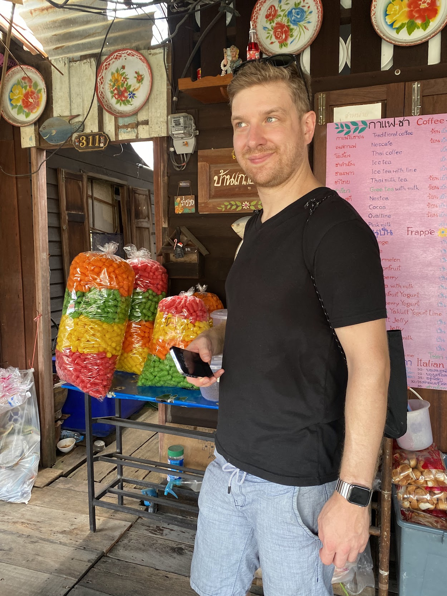<figcaption></figcaption></figure>

 

<figure>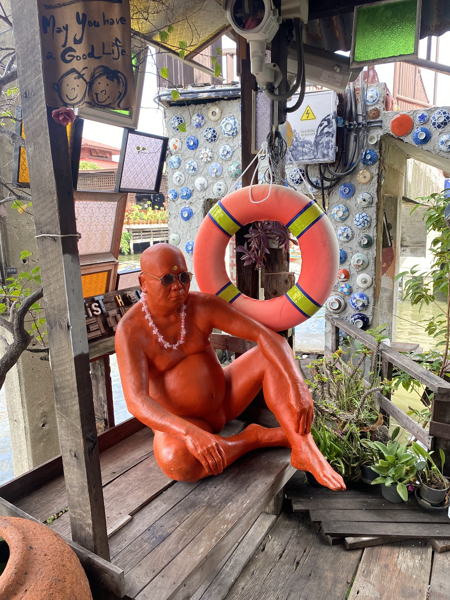<figcaption></figcaption></figure>

### Grand Palace

The Grand Palace in Bangkok, established in 1782 and once the residence of Thai monarchs, is an architectural tapestry of gilded rooftops, elaborate frescoes, and historic temples that stand as a testament to Thailand's rich dynastic and artistic legacy.

<figure>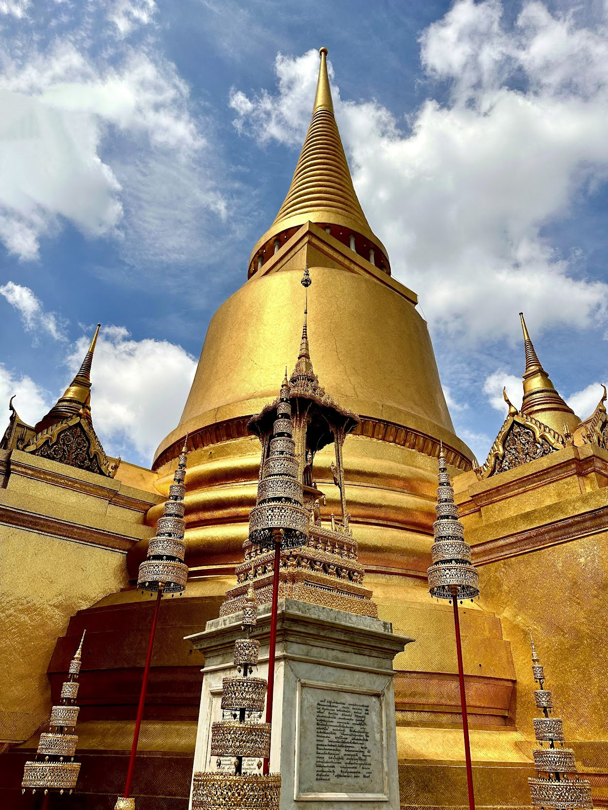<figcaption></figcaption></figure>

 

<figure>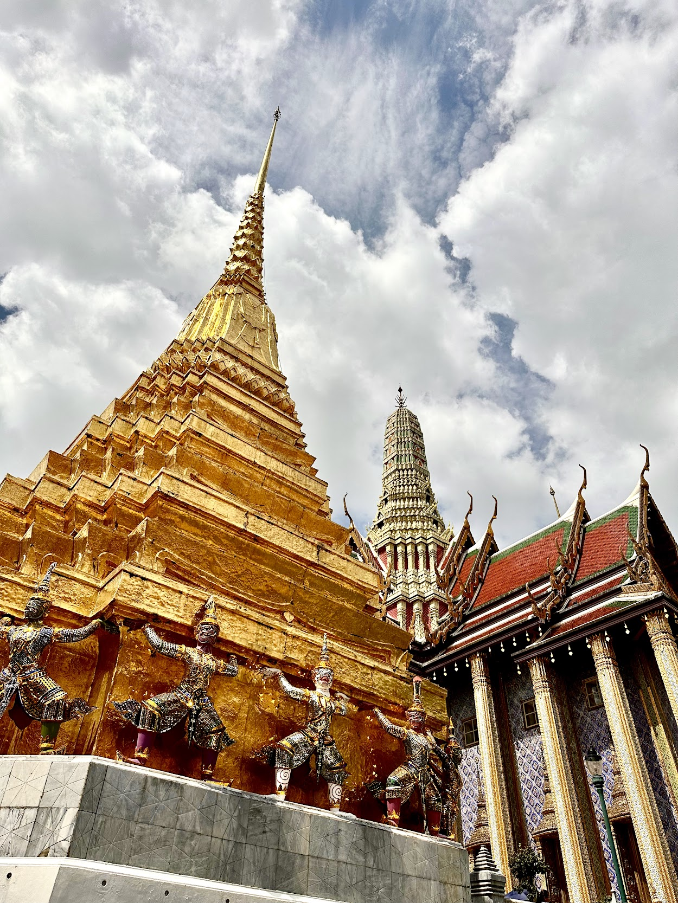<figcaption></figcaption></figure>

 

<figure>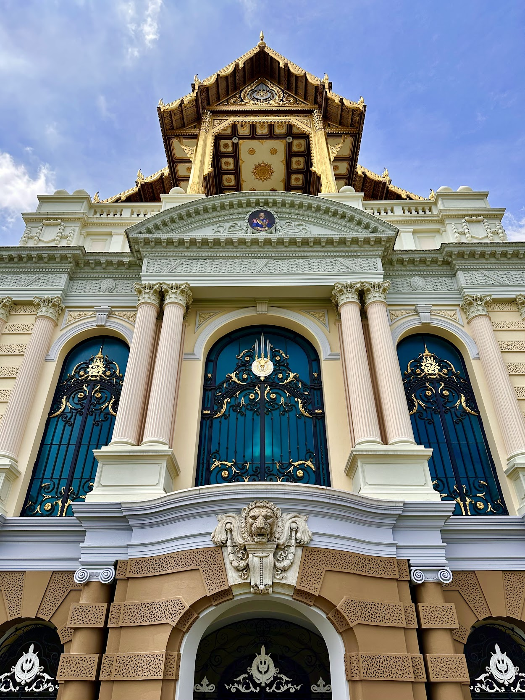<figcaption></figcaption></figure>

 

<figure>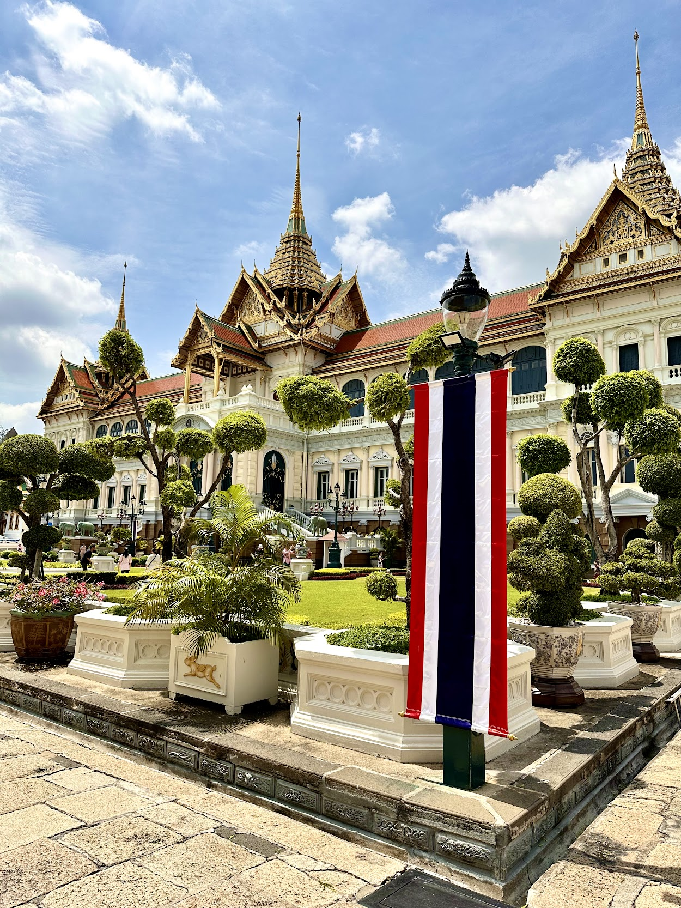<figcaption></figcaption></figure>

 

<figure>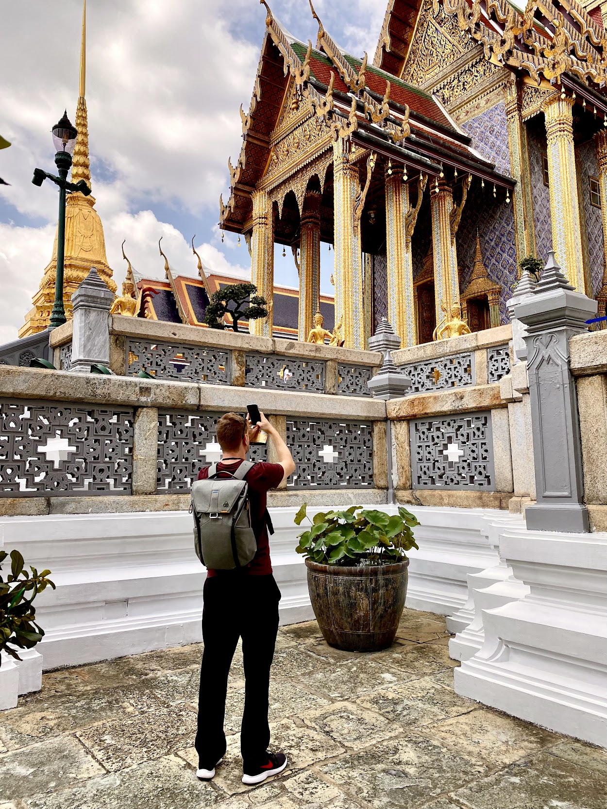<figcaption></figcaption></figure>

The ticket to the Grand Palace also includes an entry into the queens textile museum as well as a theater performance at the Royal Theater (outside the Grand Palace complex). Both are totally worth seeing. The theater starts up around mid-day and is open into the afternoon. From the Grand Palace to the Royal Theater there is also a free shuttle service that you can use.

### Khaosan Road

Khaosan Road is a bustling backpacker hub in Bangkok, teeming with lively bars, street food vendors, and an eclectic mix of travellers from around the world.

<figure><figcaption></figcaption></figure>

 

<figure><figcaption></figcaption></figure>

 

<figure><figcaption></figcaption></figure>

## Khao Sok

Khao Sok is a lush national park in southern Thailand, boasting ancient rainforests, limestone cliffs, deep-blue lakes, and diverse wildlife.

## Koh Samui

Koh Samui is a serene island in Thailand's Gulf, characterised by its white-sand beaches, coconut groves, and turquoise waters.
