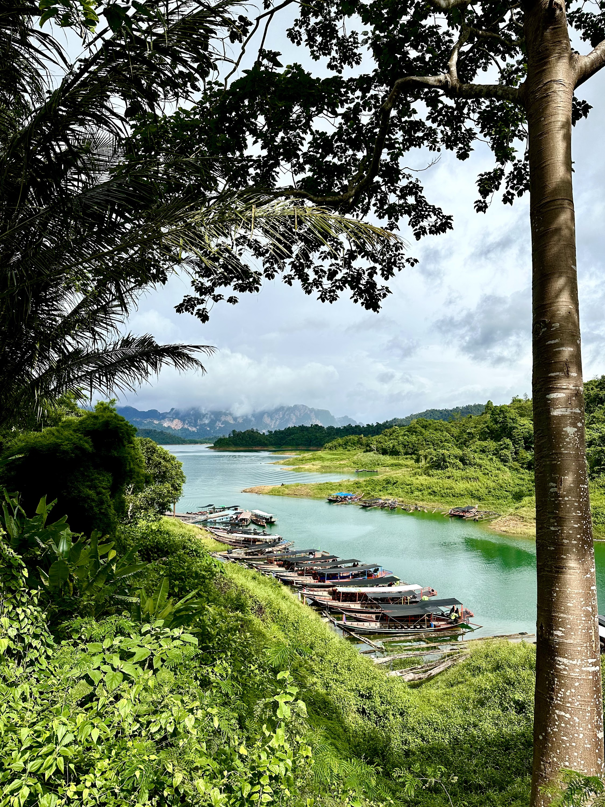

# 🇹🇭 Thailand

## Bangkok

Bangkok is Thailand's vibrant capital city, known for its ornate temples, bustling street markets, and modern skyscrapers.

### Wat Arun

Wat Arun, often referred to as the "Temple of Dawn," is an architectural marvel adorned with intricate ceramic and porcelain details, rising elegantly against the backdrop of the Chao Phraya River.

<figure><figcaption></figcaption></figure>

 

<figure><figcaption></figcaption></figure>

 

<figure><figcaption></figcaption></figure>

There's a tiny entrance fee (something like 100 thb) to enter Wat Arun, but you also get a "free" bottle of water with it, so totally worth it 😄. In front of Wat Arun there's also a ferry terminal with connections to many other ports on the river. If you can, try to go near sunset to also see it lit up at night.

### Wat Paknam

Wat Paknam is a notable temple in Thailand, home to a towering white pagoda and a striking giant Buddha statue, embodying a blend of modern and traditional designs.

<figure><figcaption>
inside the temple
</figcaption></figure>

 

<figure><figcaption>
a nice crop of the giant Buddha
</figcaption></figure>

 

<figure><figcaption>
selfie for scale 😄
</figcaption></figure>

### Khlong Bang Luang Floating Markets

The Khlong Bang Luang Floating Markets are a charming network of canals near Bangkok, where traditional boats laden with fresh produce, local crafts, and colorful textiles offer a glimpse into Thailand's vibrant cultural tapestry. The market is not "active" all the time, so beware of the local schedule. There are however also houses on stilts with little shops in them that you can visit.

<figure><figcaption></figcaption></figure>

 

<figure><figcaption></figcaption></figure>

 

<figure><figcaption></figcaption></figure>

### Grand Palace

The Grand Palace in Bangkok, established in 1782 and once the residence of Thai monarchs, is an architectural tapestry of gilded rooftops, elaborate frescoes, and historic temples that stand as a testament to Thailand's rich dynastic and artistic legacy.

<figure><figcaption></figcaption></figure>

 

<figure><figcaption></figcaption></figure>

 

<figure><figcaption></figcaption></figure>

 

<figure><figcaption></figcaption></figure>

 

<figure><figcaption></figcaption></figure>

The ticket to the Grand Palace also includes an entry into the queens textile museum as well as a theater performance at the Royal Theater (outside the Grand Palace complex). Both are totally worth seeing. The theater starts up around mid-day and is open into the afternoon. From the Grand Palace to the Royal Theater there is also a free shuttle service that you can use.

### Khaosan Road

Khaosan Road is a bustling backpacker hub in Bangkok, teeming with lively bars, street food vendors, and an eclectic mix of travellers from around the world.

<figure><figcaption></figcaption></figure>

 

<figure><figcaption>
there are tons of little restaurants with good local food
</figcaption></figure>

 

<figure><figcaption>
at night the street turns into a giant party
</figcaption></figure>

### Modern Bangkok

Of course Bangkok is also a modern city with skyscrapers, shopping malls and a metro system. A good way to experience this is to go onto the King Power Mahanakhon aka "Tetris Tower". It's the tallest building in Thailand and it offers some good views of the more modern parts of the city.

<figure><figcaption>
King Power Mahanakhon
</figcaption></figure>

 

<figure><figcaption>
The view from the observation deck of the "Tetris Tower"
</figcaption></figure>

 

<figure><figcaption>
get boba for extra energy
</figcaption></figure>

### General recommendations

* If you're struggling with the heat consider turning on "Least walking" in public the transport options for Google Maps. This will make it prefer the metro over walking even if it's taking slightly longer.
* Bring a light sweater for the air conditioned buildings. The switch between sweaty heat and ultra aircon (also known as "exchangers disease by H\*") can make you sick quickly.
* Get brown sugar bubble tea with 50% sugar

## Khao Sok

Khao Sok is a lush national park in southern Thailand, boasting ancient rainforests, limestone cliffs, deep-blue lakes, and diverse wildlife. When I was there we also got to try some of the local fruits such as Durian, Rambutan and Mangosteen. I highly recommend trying them. Personally I quite liked Durian, even though it's know for its pungent smell.

<figure><figcaption>
The verdant green rainforest
</figcaption></figure>

 

<figure><figcaption>
capturing rubber
</figcaption></figure>

 

<figure><figcaption>
a Durian fruit - quite tasty even though it's a bit smelly
</figcaption></figure>

 

<figure><figcaption>
Longtail speed boats
</figcaption></figure>

 

<figure><figcaption></figcaption></figure>

 

<figure><figcaption></figcaption></figure>

&#x20;A large part of the national park is also covered by the Cheow Lan Lake, so riding on one of the longtail speed boats and seeing the amazing cliffs is also a must.&#x20;

<figure><figcaption>
Mangosteen fruit
</figcaption></figure>

 

<figure><figcaption>
Rambutan fruit
</figcaption></figure>

## Koh Samui

Koh Samui is a serene island in Thailand's Gulf, characterised by its white-sand beaches, coconut groves, and turquoise waters. To get there you take a Seatran ferry from the mainland. It takes about an hour to travel to Koh Samui from the ferry terminal in Don Sak.

<figure><figcaption>
Seatran ferries carry you safely to Koh Samui
</figcaption></figure>

 

<figure><figcaption>
Koh Samui has beautiful beaches
</figcaption></figure>

 

<figure><figcaption></figcaption></figure>

On the island you can also go for a snorkeling trip to one of the beautiful reefs or hop on a boat and visit the famous pig island.

<figure><figcaption></figcaption></figure>

 

<figure><figcaption>
one of the many pigs on pig island
</figcaption></figure>

 

<figure><figcaption>
a sting ray chilling in the depths
</figcaption></figure>

 

<figure><figcaption></figcaption></figure>

