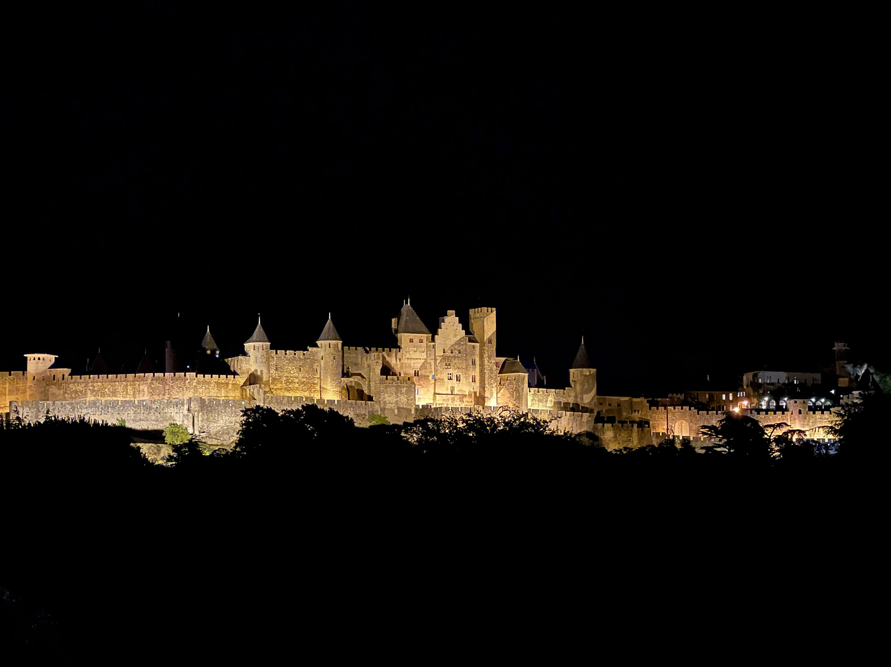
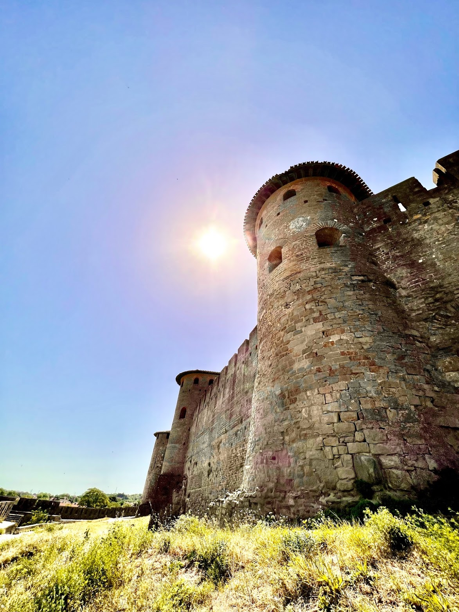
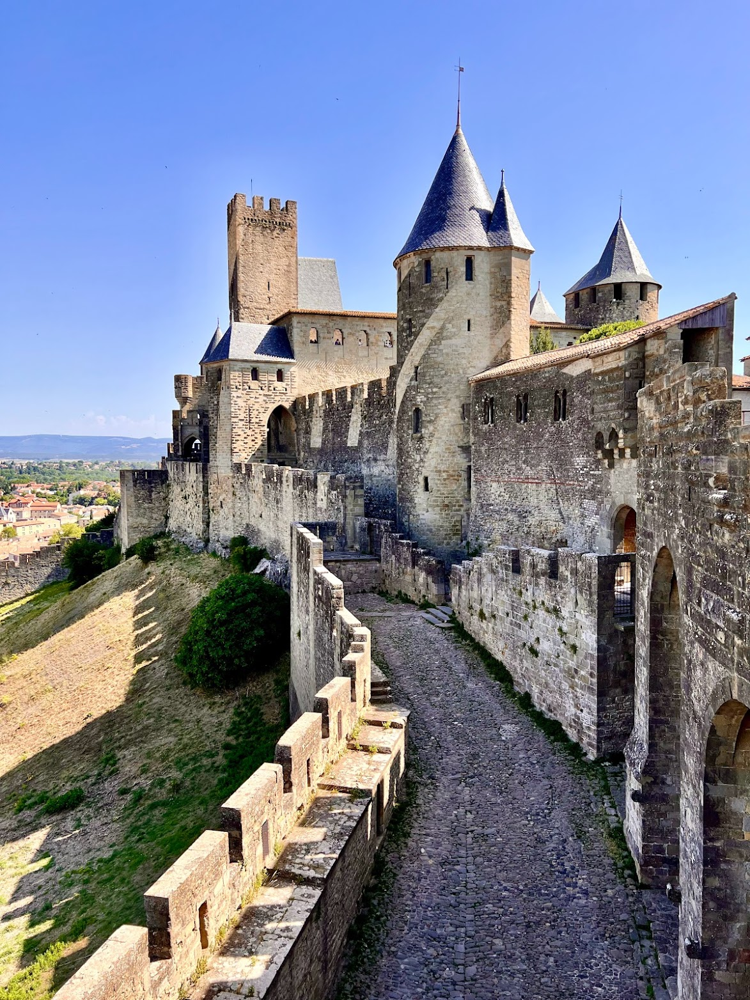
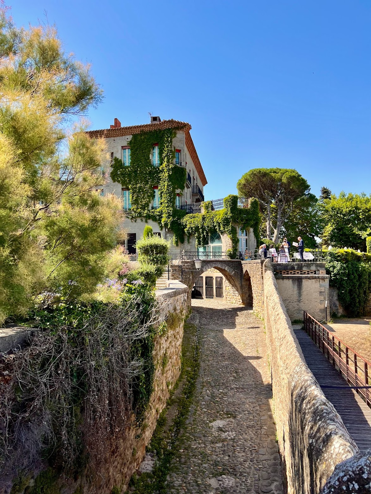
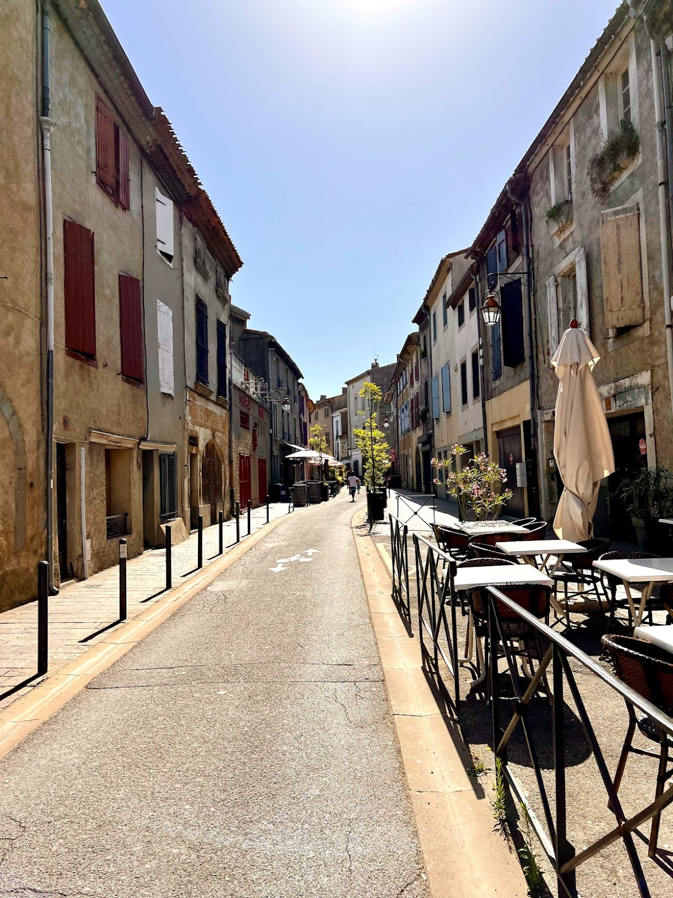
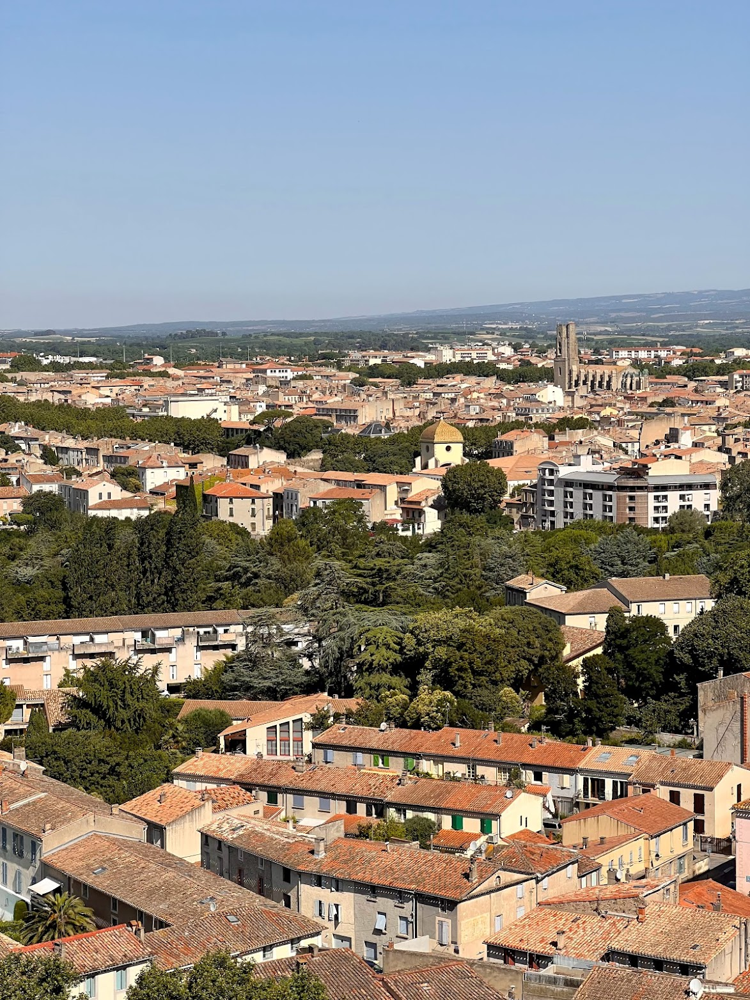
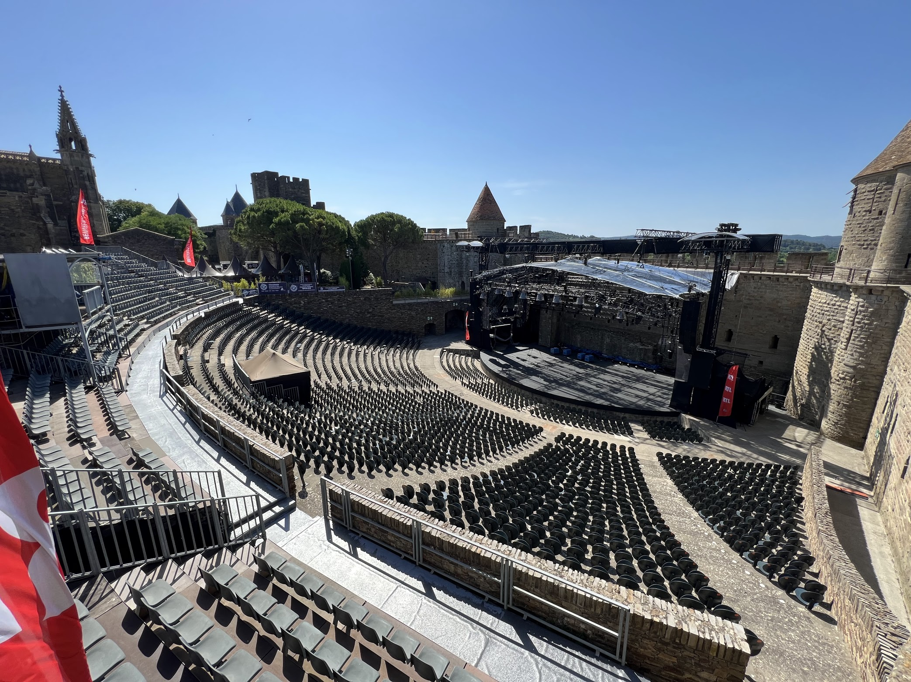
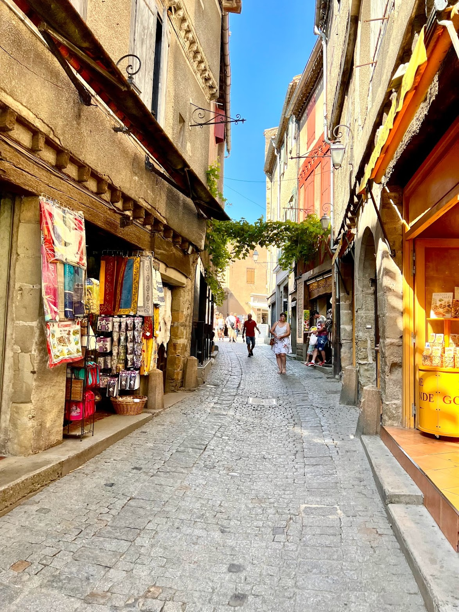

# Paris

## Getting around

Visiting all the points of interests in Paris is fairly easy thanks to the metro system. A single ride costs 1.9 euros but there's also the option to purchase a 2, 3 or 5 day pass. I opted for the 3 day pass which cost about 27 euros. So I'd have to ride 14 times to make the cost back.. but tbh just the convenience of not having to get a ticket every time is worth it. There's also the option of getting a multi ride ticket (10) for 16 euros. When staying longer it might be worth to get a Navigo card. When using the navigo card you can buy tickets on your phone and transfer them to the card via NFC. Sadly as of 2022 the Paris metro does not support fully phone based tickets nor Apple Wallet.

## Metro Zones

Typically zones 1-3 are enough for anything within Paris itself. When visiting Versailles, the airport or Disneyland zones 4-5 are needed as well.

.png>)

## Credit card & mobile payment acceptance

Everywhere seems to support credit cards and mobile payments. I haven't had to use cash anywhere.

## Points of interest in Paris

## [Le Louvre](https://www.louvre.fr/en)

   

Probably the worlds most famous museum. There's everything from famous painting such as the Mona Lisa to ancient greek and roman sculptures. Personally I don't like reading the little notes next to every object so I opted for the audio guide. The Louvre uses Nintendo 3DS for this purpose. It takes a bit of getting used to the controls but it works fairly well and the audio guide definitely adds a lot to the experience of otherwise static art pieces. It locates automatically the room you're in and you can then listen to a general overview of the room as well as info to some specific pieces. The descriptions are fairly to the point and interesting.

Getting to the Louvre is easy as there's a metro terminal underground directly connected to the Louvre. Alternatively you can also get out at Pyramides station if you have some time to kill before going into the museum.

It's important to buy the ticket online, then you can get in at a specific time without having a long wait. One thing to note is that there are two different queues for timed tickets at the glass pyramid. One is for all the half-hour time slots (e.g. 09:30, 10:30, 11:30) and the other for the full hour slots. Queuing at the right one is usually best ;-).

## [Château de Versailles](https://en.chateauversailles.fr/)

   

The palace of Versailles was the seat of the french kings, court & government starting with the rein of Louis XIV until 1789. It's basically a big palace (Chateau de Versailles) with two smaller palaces (Le Grand Trianon, Le Petit Trianon) and a huge garden :sunglasses:... well multiple gardens really but all interconnected.

When going to Versailles from Paris by public transport it's necessary to get a tickets for zones 1-5 since it's outside of the regular city zone (1-3). I took the C-train from Saint-Michel Notre Dame to Versailles Château Rive Gauche. The ride takes about 30 minutes. Btw. it's important to keep the ticket on these 1-5 zones trains as you're usually required to scan it on the exit turnstile as well. Which is different from the metro lines (1-3) where you just exit. Lastly it's a good idea to get a return ticket ahead of time.. as there's usually a wait in the end of the day with all the tourists trying to buy tickets back to Paris. I had to do this as well as I couldn't figure out how to buy the return ticket on the machine in Paris :see\_no\_evil:. On the plus side the machines on the station in Versailles accept contactless payments so it was super easy to buy a return ticket once I actually got to through the queue at the machine..

Before going to Versailles I was wondering whether it's actually worth it or if it's better to just spend the day in Paris. I think it definitely is. The castle is really nice & the audio guide (which is just an app that you can download ahead of your visit) is very well made. I think it's a much better audio guide then the Nintendo 3DS system at the Louvre. With an iPhone and Airpods you've got your hands free and it's very convenient to just tap on the next room if you're moving ahead faster. Do download the app on Wifi though if you're short on roaming data.

    

There's several ticket options to go to Versailles. The basic one only includes the main Chateau. The garden are free on a no-fountains day. The passport ticket includes the gardens on fountains days (meaning the fountains are activated) and also access to the Grand and Petit Trianon as well as the queens hamlet. I went for the passport ticket as it's only slightly more expensive and it was totally worth it. I liked the gardens outside the main Chateau but I absolutely loved the garden by around the Petit & Grand Trianon. It's a bit of a walk to get out there but definitely a must-see. The queens gardens out there are a lot more "natural" feeling.. I mean they're completely artificially made and maintained but where the main gardens are all big roads & angular lines, the queens gardens are more rounded with small pathways and little hidden tracks & benches. There's a new sight around every corner. Also the queens hamlet, which is basically a really upscale farm that the queen used to hang out around to feel like a commoner, it just looks a bit like a hobbit village or something out of a fantasy movie.

 

So overall, totally loved it. If you've got half a day or a day. Versailles is great.

## [The Paris Catacombs](https://www.catacombes.paris.fr/en)

  

Below Paris there's a network of tunnels that originated during the time when Paris was built. These tunnels were mainly excavated to get the limestone used for building houses. At some point parts of Paris also collapsed because people forgot the tunnels and all the new buildings added too much weight.. at some point the tunnels were also used to dispose of bodies. Which was also not ideal as it occasionally happened that a cellar wall collapsed and suddenly you head a bunch of bones and remains in your cellar. Later the tunnels were studied and the remains/bones cleaned up and stacked. So the tunnels that can be visited nowadays are basically long, narrow underground corridors with more bones & skulls than you've probably ever seen in one place.

It's best to buy a ticket online as the tunnels are quiet narrow and they strictly limit the amount of people that can go inside at one time. You select a time slot and you have to show up at that time to go in. Getting there via metro is easy, there's a station just around the block.

The audio-guide is included in the price, it's basically just a phone that you can listen to while you're walking through the tunnel. You can only walk in one direction and there's not chance of getting lost :smirk:. The audio guide is well made and interesting to listen to.

Is it worth it? It's a good experience. They say you should plan 1h, but really it takes about 30min to walk through. So it's maybe more pricey then other stuff like the Louvre or Versailles where you can basically spend forever to get your money's worth. Still it's quiet unique and for me it was worth it. It's also easy to squeeze in if you're just doing general Paris sightseeing.

## [Tour d'Eiffel](https://www.toureiffel.paris/en)

   

The Eiffel tower is probably the most famous landmark in Paris and maybe all of France. It's surely worth going to see it but for this trip I opted to not go up. The reason is mainly that there were no tickets available online to go up to the top on the official website and I felt like going only to the second floor kinda sucks.&#x20;

Since the tickets to go up to the top are limited it happens that scalpers buy all of them and then re-sell them online through various other websites.. although they're not prohibitively expensive I still feel like this is kinda scummy and I didn't want to support the practice.. also I've been on skyscraper before.. so I kinda felt like I've seen the whole get up high and see the city thing already.

So only a ground view of the Eiffel tower for me. But what I can recommend is the way along the Seine from Notre Dame to the Eiffel tower. It's a bit of a walk but really nice with lots of trees, shade and good stops for having a break.

# Mont Saint-Michel&#x20;

  

Mont Saint-Michel is a tidal island on the north-western coast of France. And it is indeed a world-famous sight. The abby and it's little town were built on a huge rock out in the water. This give it a rather unique look. In fact it was also a source of inspiration for the look of Minas Tirith from Lord of the Rings.

## Getting there

  

Getting to the Mont via public transport is not exactly hard but it does take time. If you want to visit only for a day it's probably easier to just book a tour from Paris. But if you want to stay the night on the little island and then it's quite nice to go by train. I took a TGV from Paris Montparnasse to Rennes and then a local TER train from Rennes to Pontorson. The trains to Pontorson only runs one or two times a day.. so you're fairly locked in to certain times. I took an early train from Paris and was in Pontorson around noon. From there you can take a bus directly to Mont Saint Michel or get out a bit earlier at the dam and walk from there. The bus is synchronised with the train service so you don't have to worry about missing it. If I remember correctly it costs like 3 euros. You can pay the fee straight to the bus driver and they do take card and offer contactless payments.

   

It's also possible to walk to and from Pontorson. The way to Mont Saint Michel is about 10km and you can just follow along a river that ends up in the bay. On the way to the Mont I took the bus to the dam but on the way back I actually walked all the way until Ponotorson and I quite enjoyed the short hike. It took me about 2h with a bunch of short breaks.

## Points of interest

On the island itself there's a few things to do. Apart from taking in the absolutely stunning architecture of the town you can go and visit the abby on the top of the Mont. It's usually not that busy so buying tickets right there is just fine. It's interesting to see the inside of the abby and listening to the audio guide is well worth it.&#x20;

   

Apart from visiting the abby you can also walk around the little town on the sand, although it's important to be careful and not to go out far due to quicksand. If you do want to go further or even cross the bay it's important to go with a guided tour.&#x20;

Inside the town you can visit various shops or restaurants and have a walk across the ramparts and so on.

## Staying on the island

  

Staying the night on Mont Saint-Michel is a bit pricey but also really beautiful. Depending on the hotel your room might be in a random little house on the island so you can really feel like living in a little medieval town. It's also cool that the place is a lot more quiet when all the day-tourists leave around 5-6pm. After that it's a lot easier to get great photos without crowds. And of course the sunset and tides are beautiful to check out. During high tide the island is completely surrounded by water, but you can still easily walk to the mainland via the bridge.

# Carcassonne

Carcassonne is a hilltop town in the south of France. It's famous for its walled city (Citadel) containing a castle. At night the outer walls of the citadel are illuminated beautifully. The citadel itself is set apart from the more modern city of Carcassonne by a river, however it still feels like very much as a part of the city. It seems like the city just kept expanding and at some point the walls and fortifications weren't necessary anymore.

<figure><figcaption>
Carcassonne at night
</figcaption></figure>

 

<figure><figcaption></figcaption></figure>

 

<figure><figcaption>
The ramparts of the citadel
</figcaption></figure>

 

<figure><figcaption></figcaption></figure>

Today the old citadel is mostly a tourist attraction. There are many little shops and restaurants but catering mostly towards visitors. Entering the citadel is free, but visiting the castle and some parts of the ramparts costs a small entry fee. It's definitely worth visiting though as the views from the castle walls are spectacular. The castle is also a fairly interesting build with good insights into how the fortifications worked against invaders. E.g. having the gate towers open towards the courtyard so that the defenders could still shoot down invaders that have managed to take over a gate tower.

<figure><figcaption>
The roads leading to the citadel also have tons of restaurants
</figcaption></figure>

 

<figure><figcaption>
A view of the modern city from the walls of the citadel
</figcaption></figure>

 

<figure><figcaption>
Event venue inside the citadel
</figcaption></figure>

 

<figure><figcaption>
Little alley inside the citadel
</figcaption></figure>

Inside the citadel there's also a huge stage for events such as concerts, theatre etc. taking place in Carcassonne.

# Notes

* [The Do’s, Don’ts, and Maybes of Mont Saint Michel](https://habitsofatravellingarchaeologist.com/the-dos-donts-and-maybes-of-mont-saint-michel/)

# New things to see

* [Aeroplume.fr](https://aeroplume.fr/en/) \[[Tom Scott: YT](https://www.youtube.com/watch?v=CwABJGzifao)]: Fly around in hangar attached to a helium blimp calibrated to your weight for 60 euros.
* Annecy \[[Insta](https://www.instagram.com/p/CnpnMoqsseI/?igshid=MDJmNzVkMjY%3D)]: Venice of the alps, nice town in France near Swiss border
* [Villa Chimnée \[Tim Traveller YT\]](https://www.youtube.com/watch?v=ODRq-EVM9r4): Holiday home/apartment on a industrial chimney. Looks like a fun place to stay for a night.&#x20;
