# Buddha Tooth Relic Temple

The Buddha Tooth Relic Temple in Singapore's Chinatown is a remarkable blend of spirituality and architecture. Home to what is believed to be a tooth relic of Buddha, the temple features multiple levels of artefacts, a rooftop garden, and a stunning gold stupa.

<figure><figcaption></figcaption></figure>

 

<figure>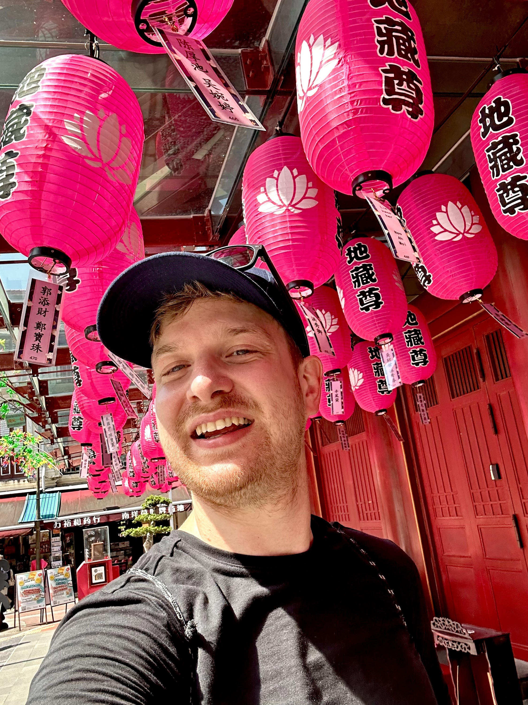<figcaption>
Temple Selfie 😄
</figcaption></figure>

 

<figure>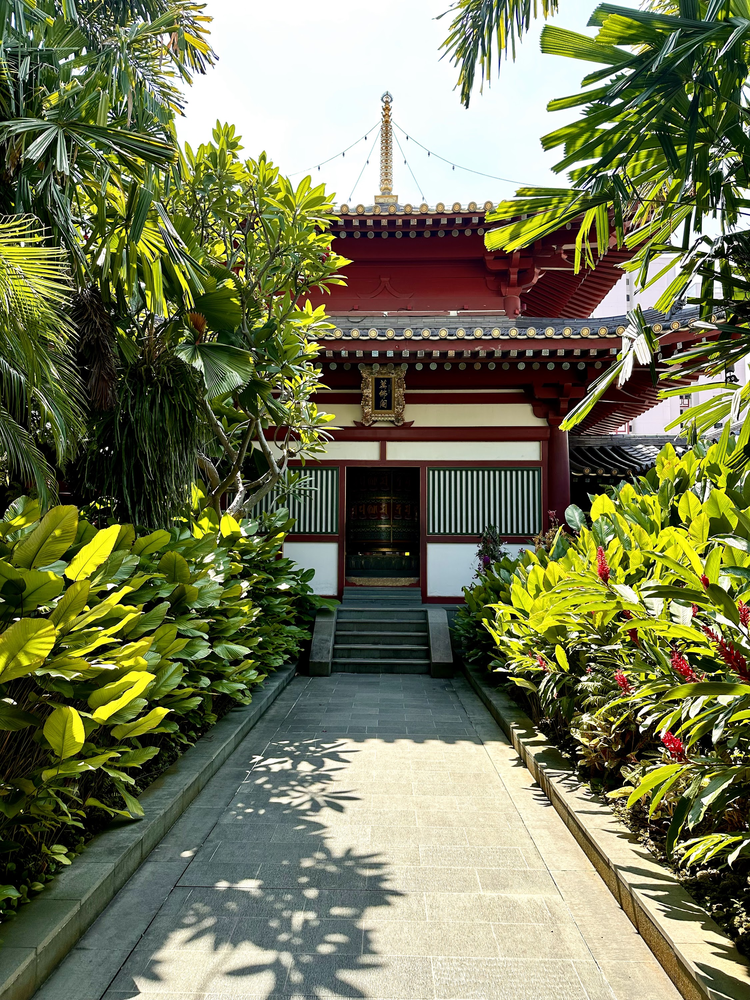<figcaption>
the rooftop garden on top of the temple
</figcaption></figure>

 

<figure>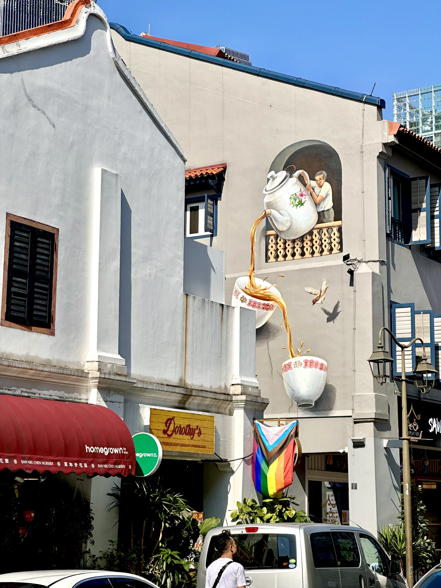<figcaption>
awesome street art
</figcaption></figure>

To get to the rooftop garden just take the elevator to the top floor and then use the stairs to get all the way up.

# Gardens by the Bay

Probably Singapore's most well-known feature are the beautiful Gardens by the Bay. This sprawling 101-hectare oasis in the heart of the city is a horticultural spectacle that challenges the boundaries between nature and urban life. Home to the iconic Supertree Grove and the climate-controlled Cloud Forest and Flower Dome, this garden offers a unique blend of awe-inspiring landscapes and innovative engineering. Whether you're walking on the skyway among the towering Supertrees or immersing yourself in the misty wonder of the Cloud Forest, Gardens by the Bay is an unforgettable journey through diverse ecosystems and spellbinding views.

<figure>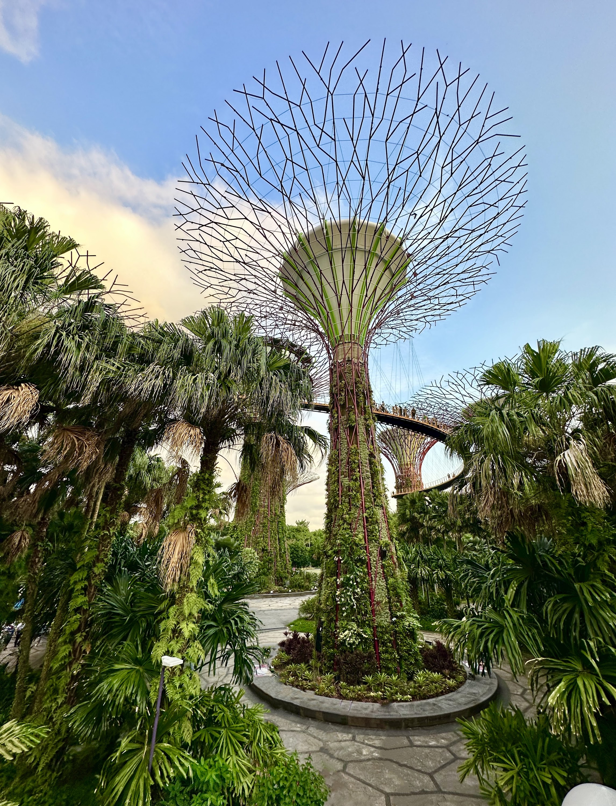<figcaption></figcaption></figure>

 

<figure>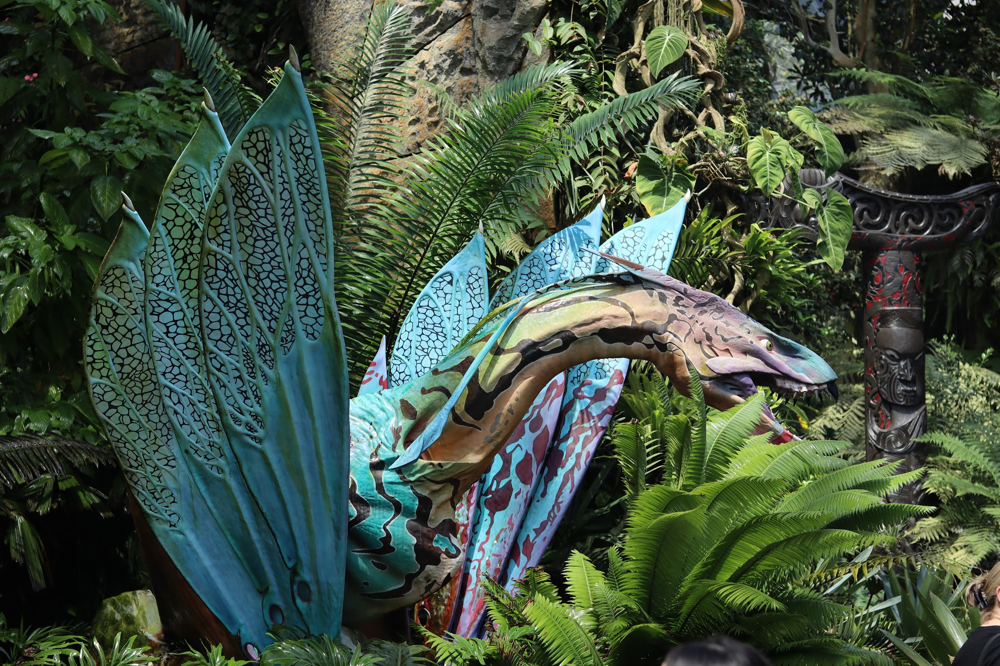<figcaption></figcaption></figure>

 

<figure>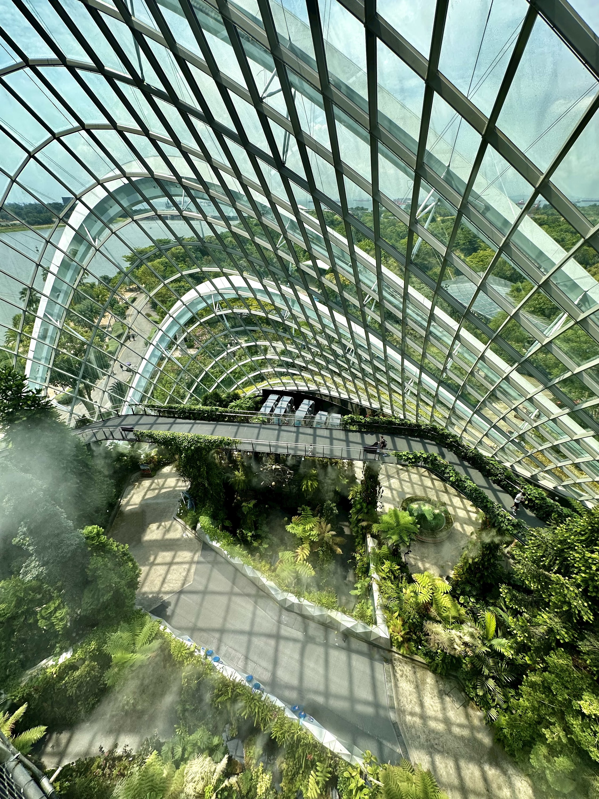<figcaption></figcaption></figure>

 

<figure>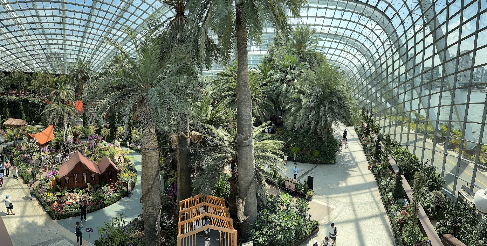<figcaption></figcaption></figure>

At night, the Supertree Grove transforms into a mesmerizing spectacle, as the towering structures come alive in a kaleidoscope of colors during the Garden Rhapsody light and sound show.

<figure><figcaption></figcaption></figure>

 

<figure><figcaption></figcaption></figure>

 

<figure><figcaption></figcaption></figure>

Marina Bay Sands is a triple treat: luxury lodging, high-end shopping at The Shoppes, and leisure experiences like a skybar and an iconic infinity pool overlooking the city.

<figure>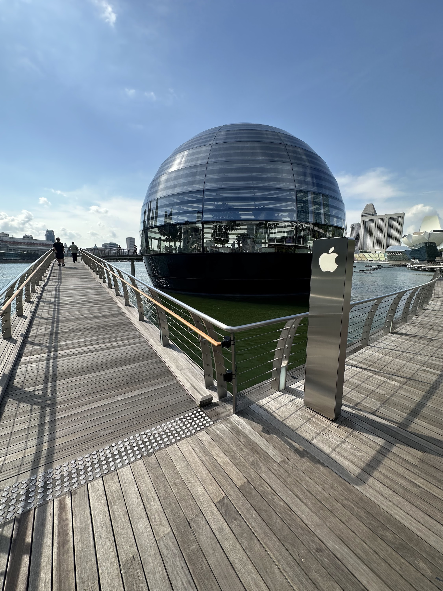<figcaption>
pretty apple store
</figcaption></figure>

 

<figure><figcaption></figcaption></figure>

 

<figure>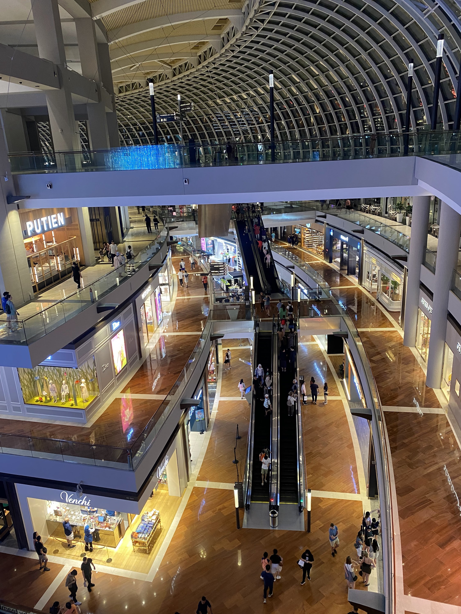<figcaption></figcaption></figure>

 

<figure>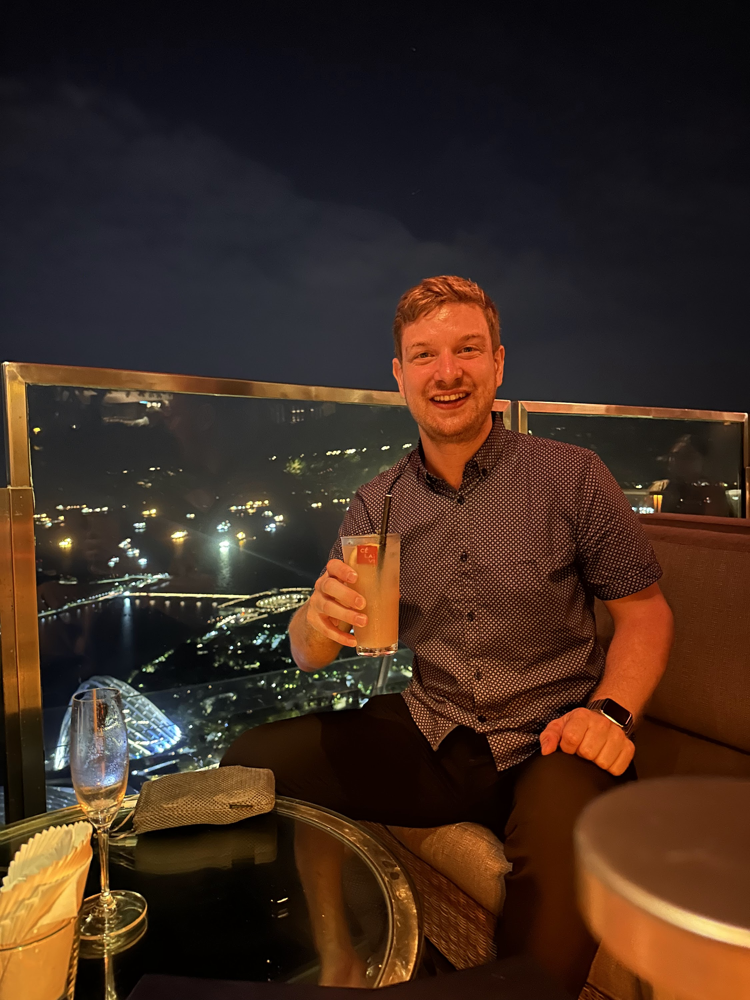<figcaption>
enjoying a drink in the skybar
</figcaption></figure>

 

<figure>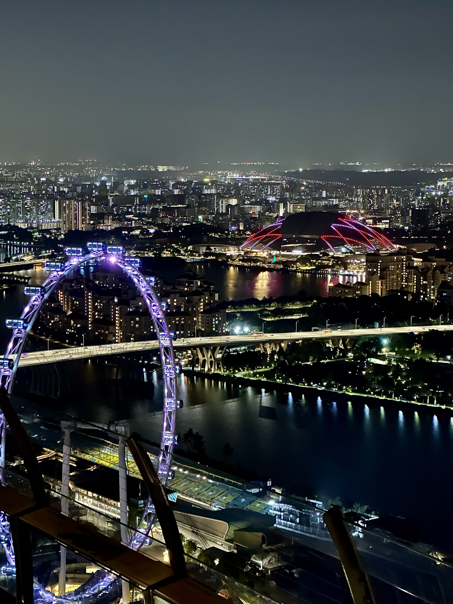<figcaption></figcaption></figure>

